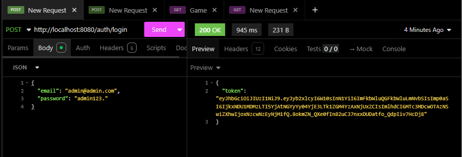
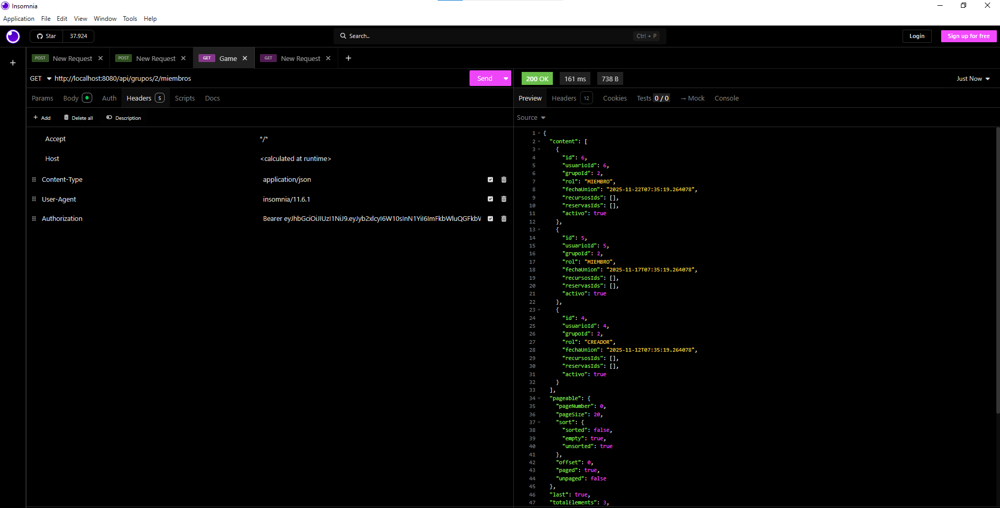
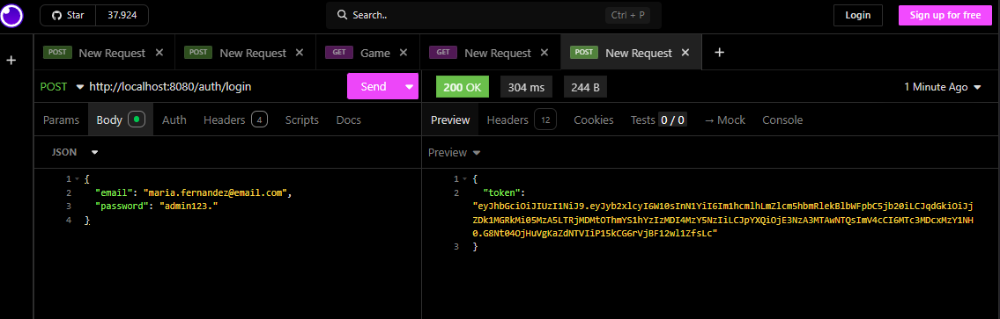
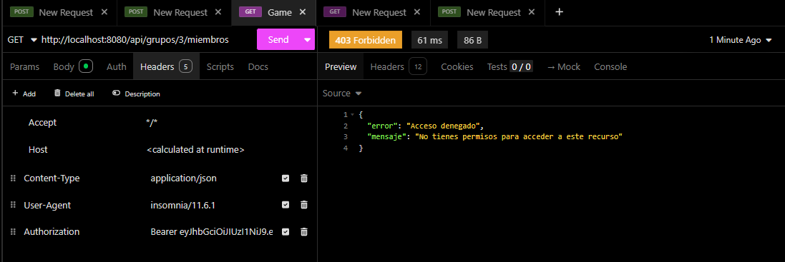
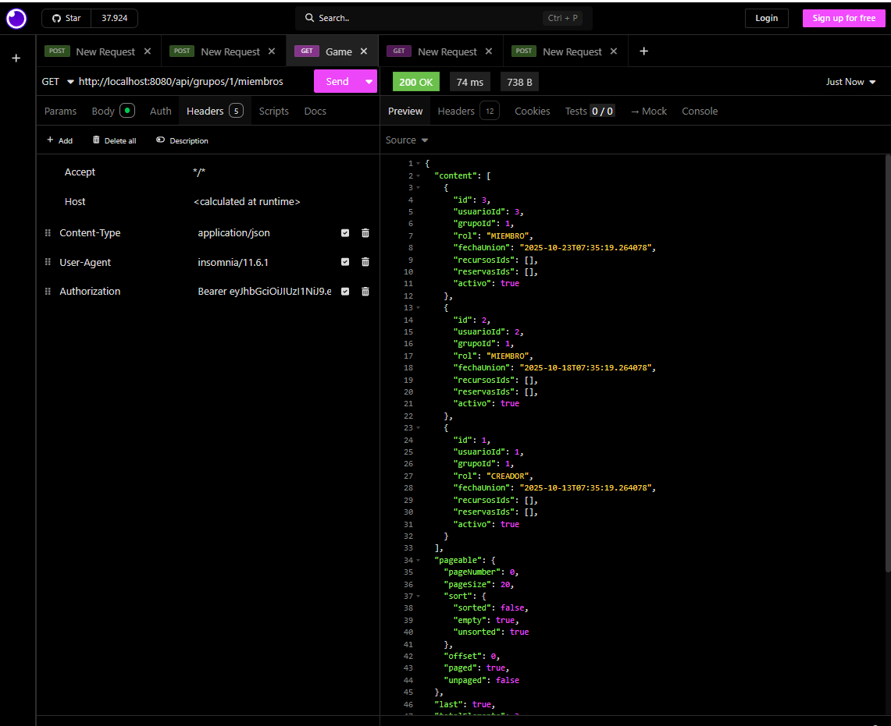

# Documentación prueba práctica DWES

## Qué endpoint has creado y por qué.

He creado un endpoint para grupos, donde se listan los miembros que pertenecen a ese grupo. En este endpoint se utiliza paginación. Lo he implementado porque al inicio del proyecto definí una página donde se muestran los miembros del grupo y no lo llegué a implementar. Además de que sirve de información a los usuarios para poder ver los miembros pertenecientes a su grupo.

La ruta hacia el endpoint es ``http://localhost:8080/api/grupos/{id}/miembros`

## Cómo has implementado la seguridad.

He implementado reglas de autorización en el endpoint mediante la anotación @PreAuthorize:

```java
	@GetMapping("/{id}/miembros")
	@PreAuthorize("hasRole('ADMIN') or @grupoSecurity.esMiembro(#id)")
	public ResponseEntity<Page<MiembroGrupoResponseDTO>> obtenerRecursos(
		@Parameter(description = "ID del grupo") @PathVariable Long id,
		Pageable pageable) {
		return ResponseEntity.ok(grupoService.obtenerMiembros(id, pageable));
}
```
Esto verifica que el usuario tenga rol de admin (pudiendo tener rol: USER o ADMIN) y que el usuario sea miembro de ese grupo mediante el servicio grupoSecurity que tiene el método esMiembro para verificar si ese usuario pertenece al grupo.

Método en grupoSecurityService para comprobar si es miembro:
``` java
	public boolean esMiembro(Long grupoId) {
        Optional<Usuario> usuario = obtenerUsuarioActual();
        return usuario.map(u -> miembroRepo.existsByUsuarioIdAndGrupoId(u.getId(), grupoId)).orElse(false);
    }
```

## Capturas o comandos para probarlo.

He realizado pruebas para verificar el correcto funcionamiento del endpoint. 

1. Accediendo al endpoint con un usuario admin.

Primero realizo el login con el usuario que es admin.
```
{
	"email": "admin@admin.com",
	"password": "admin123."
}
```



Después he probado el endpoint para obtener los miembros del grupo 2.
He utilizado el token que me devuelve en la respuesta `auth/login` y lo añadí en el header Authorization: Bearer "Token".

Endpoint utilizado `http://localhost:8080/api/grupos/2/miembros`
`

2. Accediendo al endpoint con un usuario (no admin) no perteneciente al grupo.

Primero realizo el login con el usuario que no es perteneciente al grupo (se usa el 3 y este usuario pertenece al 1).
```
{
	"email": "maria.fernandez@email.com",
	"password": "admin123."
}
```



Después he probado el endpoint para obtener los miembros del grupo 3 (donde no pertenece este usuario).
He utilizado el token que me devuelve en la respuesta `auth/login` y lo añadí en el header Authorization: Bearer "Token".

Endpoint utilizado `http://localhost:8080/api/grupos/3/miembros`
`

Como se puede apreciar da un error 403 Forbidden, ya que este usuario no tiene permisos para acceder a los miembros del grupo porque no pertenece a ese grupo y muestra en la respuesta metadatos del error. 

3. Accediendo al endpoint con un usuario (no admin) perteneciente al grupo (se usa el 1 y este usuario pertenece a ese grupo).

Primero realizo el login con el usuario que es perteneciente al grupo.
```
{
	"email": "maria.fernandez@email.com",
	"password": "admin123."
}
```


Después he probado el endpoint para obtener los miembros del grupo 1 (donde pertenece este usuario).
He utilizado el token que me devuelve en la respuesta `auth/login` y lo añadí en el header Authorization: Bearer "Token".

Endpoint utilizado `http://localhost:8080/api/grupos/1/miembros`
`
