# Backend (Spring Boot + PostgreSQL)

API REST del proyecto Cohabit, implementada con Spring Boot y PostgreSQL.

## Requisitos

- Java 17+
- Maven
- PostgreSQL (configurable en `src/main/resources/application.properties`)
- Docker

## Cómo ejecutar

1. Configurar (si es necesario) variables de configuración en `src/main/resources/application.properties` o en las variables de entorno usadas por Docker Compose.
2. Levantar los servicios con Docker Compose (desde la raíz del proyecto):

```bash
docker compose up --build -d
```

## Estructura

En la carpeta `backend` la organización principal sigue la convención típica de un proyecto Spring Boot. A continuación se describen las carpetas más relevantes y su propósito.

### Entity

La carpeta `src/main/java/com/cohabit/cohabit_backend/entity` contiene las clases que representan el modelo de dominio y se mapean a las tablas de la base de datos mediante JPA. Aquí se definen atributos, relaciones y reglas de persistencia (anotaciones JPA, mapeos, callbacks como `@PrePersist`/`@PreUpdate`).

#### Usuario

La entidad `Usuario` representa a una persona registrada en la aplicación. Campos principales: `id`, `nombre`, `apellidos`, `email` (único), `password`, `rol` (por ejemplo `ADMIN` o `USUARIO`), `fotoPerfil`, `pais`, `ciudad`, `telefono` y `fechaRegistro` (inicializado con `@PrePersist`). Además mantiene una relación 1:1 con `MiembroGrupo` cuando el usuario se asocia a un grupo.

#### Grupo

La entidad `Grupo` modela una unidad de convivencia o comunidad. Campos principales: `id`, `nombre`, `direccion`, `descripcion`, `fotoGrupo`, `codigoInvitacion` (único), `fechaCreacion` y `fechaActualizacion`. Un `Grupo` tiene muchos `MiembroGrupo` y muchos `Recurso`, y referencia al `Usuario` creador (`creador_id`).

#### MiembroGrupo

`MiembroGrupo` representa la pertenencia de un `Usuario` a un `Grupo`. Campos principales: `id`, `usuario_id` (FK al `Usuario`), `grupo_id` (FK al `Grupo`), `rol` (enum, p. ej. `CREADOR`), `fechaUnion` (inicializado con `@PrePersist`) y `activo` (boolean). Mantiene colecciones de `Reserva` y de `Recurso` creados por ese miembro.

#### Recurso

`Recurso` es un elemento que puede reservarse (p. ej. habitación, electrodoméstico, vehículo). Campos principales: `id`, `nombre`, `descripcion`, `fotoRecurso`, `capacidad`, `ubicacion`, `tipo` (enum), `estadoActual` (enum), `grupo_id` (FK), `miembro_grupo_id` (FK opcional al creador), `numero` (Integer, secuencial dentro del `Grupo`), `fechaCreacion` y `fechaActualizacion`. Contiene colecciones de `ReglaRecurso` y `Reserva` asociadas.

#### Reserva

`Reserva` guarda solicitudes de uso de un `Recurso`. Campos principales: `id`, `fecha`, `horaInicio`, `horaFin`, `notas`, `numPersonas`, `estado` (enum), `miembro_grupo_id` (FK al solicitante), `recurso_id` (FK al recurso), `numero` (Integer, secuencial dentro del `Recurso`) y timestamps `fechaCreacion`/`fechaActualizacion`.

#### ReglaRecurso

`ReglaRecurso` contiene restricciones o configuraciones aplicables a un `Recurso` (por ejemplo, horario permitido, aforo máximo). Campos principales: `id`, `tipoRegla` (enum), `valor`, `descripcion`, `recurso_id` (FK), `miembro_grupo_id` (FK al creador — obligatorio), `numero` (Integer, secuencial dentro del `Recurso`) y timestamps `fechaCreacion`/`fechaActualizacion`.


### DTO

La carpeta `src/main/java/com/cohabit/cohabit_backend/dto` contiene los objetos usados para la comunicación entre capa de servicio/controlador y el exterior (requests/responses). Esto evita exponer la estructura interna y facilita validaciones.

#### Lista
- `UsuarioRequestDTO` / `UsuarioResponseDTO` / `UsuarioUpdateDTO`: entidad `Usuario`.
- `GrupoRequestDTO` / `GrupoResponseDTO` / `GrupoUpdateDTO`: entidad `Grupo`.
- `MiembroGrupoRequestDTO` / `MiembroGrupoResponseDTO` / `MiembroGrupoUpdateDTO`: entidad `MiembroGrupo`.
- `RecursoRequestDTO` / `RecursoResponseDTO` / `RecursoUpdateDTO`: entidad `Recurso`.
- `ReservaRequestDTO` / `ReservaResponseDTO` / `ReservaUpdateDTO`: entidad `Reserva`.
- `ReglaRecursoRequestDTO` / `ReglaRecursoResponseDTO` / `ReglaRecursoUpdateDTO`: entidad `ReglaRecurso`.
- `ApiErrorDTO`

Nota: los DTOs de `Request` son para las peticiones POST, `Response` para las peticiones GET o peticiones que devuelvan información y los DTOs de actualización (`UpdateDTO`) usados para las operaciones PATCH/PUT desde el cliente. 

### Mapper

Los mappers convierten entre entidades y DTOs. Están en `src/main/java/com/cohabit/cohabit_backend/mapper` y centralizan la transformación, evitando lógica de mapeo duplicada en servicios.

### Repository

Los repositorios JPA están en `src/main/java/com/cohabit/cohabit_backend/repository` y extienden `JpaRepository`. Proveen consultas básicas y métodos personalizados para acceder a la base de datos.

- `UsuarioRepository`, `GrupoRepository`, `RecursoRepository`, `MiembroGrupoRepository`, `ReservaRepository`, `ReglaRecursoRepository`.

### Service

La capa de servicio (paquete `service`) implementa la lógica de negocio: validaciones, transacciones y orquestación entre repositorios y mappers. Cada servicio expone métodos CRUD y operadores de negocio específicos. Servicios utilizados:

- `UsuarioService`: CRUD usuarios y validaciones.
- `GrupoService`: creación con generación de `codigoInvitacion`, gestión de miembros.
- `MiembroGrupoService`: gestión de roles y acciones del usuario en el grupo.
- `RecursoService`: CRUD recursos y validaciones.
- `ReglaRecursoService`: CRUD reglas y validaciones.
- `ReservaService`: Crud reservas y validaciones

### Controller

Los controladores exponen la API REST y traducen DTOs a llamadas a servicios. Se encargan de paginación, ordenación, filtrado, validación básica (`@Valid`) y de devolver códigos HTTP adecuados.

#### Controladores y responsabilidades
- `UsuarioController` (`/api/usuarios`): rutas para CRUD de usuarios.
- `GrupoController` (`/api/grupos`): CRUD de grupos y creación de código de invitación.
- `MiembroGrupoController` (`/api/miembros`): gestionar miembros del grupo.
- `RecursoController` (`/api/recursos`): CRUD recursos.
- `ReglaRecursoController` (`/api/reglas`): CRUD reglas.
- `ReservaController` (`/api/reservas`): CRUD reservas.


## Modelo de Datos

Diagrama E/R:

[Enlace a Mermaid](https://www.mermaidchart.com/d/2ee3acee-05dd-400f-ae45-d5ee4f915663)



Relaciones entre tablas (formato: EntidadIzq (min,max)  .....  relación  .....  (min,max) EntidadDer):

- MiembroGrupo (1,1)  .....  1:1  .....  (0,1) Usuario

- Grupo (0,N)  .....  1:N  .....  (1,1) MiembroGrupo

- Grupo (0,N)  .....  1:N  .....  (1,1) Recurso

- Recurso (1,1)  .....  N:1  .....  (0,1) MiembroGrupo (creador opcional)

- MiembroGrupo (0,N)  .....  1:N  .....  (1,1) Reserva

- Recurso (0,N)  .....  1:N  .....  (1,1) Reserva

- Recurso (0,N)  .....  1:N  .....  (1,1) ReglaRecurso

- Grupo (1,1)  .....  1:1  .....  (0,1) Usuario (creador)

Descripción de las cardinalidades:

- `MiembroGrupo` referencia exactamente a 1 `Usuario` (`usuario_id` es NOT NULL y único). Un `Usuario` puede no pertenecer a ningún `MiembroGrupo` o pertenecer a uno como máximo (0..1).
- `MiembroGrupo` pertenece exactamente a 1 `Grupo` (`grupo_id` NOT NULL). Un `Grupo` puede tener cero o varios `MiembroGrupo` (0..N).
- `Recurso` pertenece exactamente a 1 `Grupo` (`grupo_id` NOT NULL). Un `Grupo` puede tener cero o varios `Recurso` (0..N).
- `Recurso.creador` (campo `miembro_grupo_id`) es opcional: un `Recurso` puede haber sido creado por 0 o 1 `MiembroGrupo`.
- `Reserva` pertenece exactamente a 1 `MiembroGrupo` y a 1 `Recurso` (`miembro_grupo_id` y `recurso_id` NOT NULL). Un `MiembroGrupo` puede realizar cero o varias `Reserva`; un `Recurso` puede tener cero o varias `Reserva`.
- `ReglaRecurso` pertenece exactamente a 1 `Recurso` (`recurso_id` NOT NULL) y registra un `MiembroGrupo` creador (`miembro_grupo_id` NOT NULL). Un `Recurso` puede tener cero o varias `ReglaRecurso`; un `MiembroGrupo` puede crear cero o varias `ReglaRecurso`.
- `Grupo.creador` (`creador_id`) es obligatorio (NOT NULL) y único: cada `Grupo` tiene exactamente 1 `Usuario` creador; un `Usuario` puede ser creador de 0 o 1 `Grupo`.

Estas son las entidades principales de la API

### Usuario

| Campo | Tipo (Java) | PK / FK | Validaciones / restricciones | Descripción |
|---|---:|:---:|---|---|
| id | Long | PK | @Id, @GeneratedValue | Identificador único del usuario |
| nombre | String |  | @Column(nullable=false) | Nombre propio |
| apellidos | String |  | @Column(nullable=false) | Apellidos |
| email | String |  | @Column(nullable=false, unique=true) | Correo electrónico (único) |
| password | String |  | @Column(nullable=false) | Contraseña (hash en aplicación) |
| rol | RolUsuario (enum) |  | @Enumerated(EnumType.STRING), @Column(nullable=false) | Rol del usuario (ADMIN` o `USUARIO`) |
| fotoPerfil | String |  |  | URL o referencia a foto de perfil |
| pais | String |  |  | País del usuario |
| ciudad | String |  |  | Ciudad del usuario |
| telefono | String |  |  | Teléfono de contacto |
| fechaRegistro | LocalDateTime |  | @Column(nullable=false), @PrePersist | Fecha de registro |

Relaciones:
- `Usuario` 0..1 — 1 `MiembroGrupo`: cada `MiembroGrupo` referencia exactamente 1 `Usuario` (FK `miembros_grupo.usuario_id` NOT NULL, unique); un `Usuario` puede no pertenecer a ningún `MiembroGrupo` o pertenecer a uno.

### Grupo

| Campo | Tipo (Java) | PK / FK | Validaciones / restricciones | Descripción |
|---|---:|:---:|---|---|
| id | Long | PK | @Id, @GeneratedValue | Identificador único del grupo |
| nombre | String |  | @Column(nullable=false) | Nombre del grupo |
| direccion | String |  |  | Dirección del domicilio o local |
| descripcion | String |  | @Column(length=1000) | Descripción del grupo |
| fotoGrupo | String |  |  | URL o referencia a imagen del grupo |
| codigoInvitacion | String |  | @Column(nullable=false, unique=true) | Código de invitación generado |
| fechaCreacion | LocalDateTime |  | @Column(nullable=false), @PrePersist | Fecha de creación |
| fechaActualizacion | LocalDateTime |  | @Column(nullable=false), @PreUpdate | Fecha de última actualización |
| creador_id | Long | FK -> Usuario | @OneToOne(fetch=LAZY), @JoinColumn(nullable=false, unique=true) | Referencia al `Usuario` creador (único) |

Relaciones:
- `Grupo` 0..N — 1 `MiembroGrupo`: un `Grupo` puede tener cero o varios `MiembroGrupo` (FK en `miembros_grupo.grupo_id`).
- `Grupo` 0..N — 1 `Recurso`: un `Grupo` puede tener cero o varios `Recurso` (FK en `recursos.grupo_id`).
- `Grupo` 1 — 0..1 `Usuario` (creador): el `Grupo` tiene un `Usuario` creador (FK `grupos.creador_id` NOT NULL, unique); un `Usuario` puede ser creador de 0 o 1 `Grupo`.

### MiembroGrupo

| Campo | Tipo (Java) | PK / FK | Validaciones / restricciones | Descripción |
|---|---:|:---:|---|---|
| id | Long | PK | @Id, @GeneratedValue | Identificador del miembro |
| usuario_id | Long | FK -> Usuario (único) | @OneToOne, @JoinColumn(nullable=false, unique=true) | Usuario asociado al miembro |
| grupo_id | Long | FK -> Grupo | @ManyToOne, @JoinColumn(nullable=false) | Grupo al que pertenece |
| rol | RolGrupo (enum) |  | @Enumerated(EnumType.STRING), @Column(nullable=false) | Rol del miembro en el grupo (MIEMBRO, ADMIN o CREADOR) |
| fechaUnion | LocalDateTime |  | @Column(nullable=false), @PrePersist | Fecha de unión al grupo |
| activo | boolean |  | @Column(nullable=false), default true | Indica si la membresía está activa |

Relaciones:
- `MiembroGrupo` N:1 `Grupo` (FK `grupo_id` NOT NULL)
- `MiembroGrupo` 1:1 `Usuario` (FK `usuario_id` NOT NULL, unique)
- `MiembroGrupo` 1:N `Reserva` (un miembro puede realizar cero o varias reservas)
- `MiembroGrupo` 1:N `Recurso` (un miembro puede crear cero o varios recursos)
- `MiembroGrupo` 1:N `ReglaRecurso` (un miembro puede crear cero o varias reglas)

### Recurso

| Campo | Tipo (Java) | PK / FK | Validaciones / restricciones | Descripción |
|---|---:|:---:|---|---|
| id | Long | PK | @Id, @GeneratedValue | Identificador del recurso |
| nombre | String |  | @Column(nullable=false) | Nombre del recurso |
| descripcion | String |  | @Column(length=1000) | Descripción detallada |
| fotoRecurso | String |  |  | URL o referencia a imagen |
| capacidad | Integer |  |  | Capacidad o aforo (>=1 si indicado) |
| ubicacion | String |  |  | Ubicación dentro del grupo |
| tipo | TipoRecurso (enum) |  | @Enumerated(EnumType.STRING), @Column(nullable=false) | Tipo de recurso |
| estadoActual | EstadoRecurso (enum) |  | @Enumerated(EnumType.STRING), @Column(nullable=false) | Estado actual del recurso |
| grupo_id | Long | FK -> Grupo | @ManyToOne, @JoinColumn(nullable=false) | Grupo propietario del recurso |
| miembro_grupo_id | Long | FK -> MiembroGrupo | @ManyToOne, @JoinColumn(nullable=true) | Miembro que creó el recurso (opcional) |
| numero | Integer |  | @Column(nullable=false) | Número secuencial local dentro del grupo/recurso para mostrar en UIs |
| fechaCreacion | LocalDateTime |  | @Column(nullable=false), @PrePersist | Fecha creación |
| fechaActualizacion | LocalDateTime |  | @PreUpdate | Fecha última actualización |

Relaciones:
- `Recurso` N:1 `Grupo` (FK `grupo_id` NOT NULL)
- `Recurso` 0..1 — 1 `MiembroGrupo` (creador opcional; FK `miembro_grupo_id` nullable)
- `Recurso` 1:N `Reserva` (un recurso puede tener cero o varias reservas)
- `Recurso` 1:N `ReglaRecurso` (un recurso puede tener cero o varias reglas)

### Reserva

| Campo | Tipo (Java) | PK / FK | Validaciones / restricciones | Descripción |
|---|---:|:---:|---|---|
| id | Long | PK | @Id, @GeneratedValue | Identificador de la reserva |
| fecha | LocalDate |  | @Column(nullable=false) | Fecha de la reserva |
| horaInicio | LocalTime |  | @Column(nullable=false) | Hora de inicio |
| horaFin | LocalTime |  | @Column(nullable=false) | Hora de fin |
| notas | String |  | @Column(length=1000) | Notas adicionales |
| numPersonas | Integer |  |  | Número de personas (si aplica) |
| estado | EstadoReserva (enum) |  | @Enumerated(EnumType.STRING), @Column(nullable=false) | Estado de la reserva |
| miembro_grupo_id | Long | FK -> MiembroGrupo | @ManyToOne, @JoinColumn(nullable=false) | Solicitante de la reserva |
| recurso_id | Long | FK -> Recurso | @ManyToOne, @JoinColumn(nullable=false) | Recurso reservado |
| numero | Integer |  | @Column(nullable=false) | Número secuencial local de la reserva dentro del recurso/group |
| fechaCreacion | LocalDateTime |  | @Column(nullable=false), @PrePersist | Fecha creación |
| fechaActualizacion | LocalDateTime |  | @PreUpdate | Fecha última actualización |

Relaciones:
- `Reserva` N:1 `MiembroGrupo` (FK `miembro_grupo_id` NOT NULL) — un `MiembroGrupo` puede tener cero o varias reservas
- `Reserva` N:1 `Recurso` (FK `recurso_id` NOT NULL) — un `Recurso` puede tener cero o varias reservas

### ReglaRecurso

| Campo | Tipo (Java) | PK / FK | Validaciones / restricciones | Descripción |
|---|---:|:---:|---|---|
| id | Long | PK | @Id, @GeneratedValue | Identificador de la regla |
| tipoRegla | TipoRegla (enum) |  | @Enumerated(EnumType.STRING), @Column(nullable=false) | Tipo de regla (ej. HORARIO, AFORO) |
| valor | String |  | @Column(nullable=false) | Valor de la regla (p. ej. "08:00-20:00" o "6") |
| descripcion | String |  | @Column(length=1000) | Descripción de la regla |
| recurso_id | Long | FK -> Recurso | @ManyToOne, @JoinColumn(nullable=false) | Recurso al que aplica |
| miembro_grupo_id | Long | FK -> MiembroGrupo | @ManyToOne, @JoinColumn(nullable=false) | Miembro que creó la regla (NN, obligatorio) |
| numero | Integer |  | @Column(nullable=false) | Número secuencial local de la regla dentro del recurso |
| fechaCreacion | LocalDateTime |  | @Column(nullable=false), @PrePersist | Fecha creación |
| fechaActualizacion | LocalDateTime |  | @PreUpdate | Fecha última actualización |

Relaciones:
- `ReglaRecurso` N:1 `Recurso` (FK `recurso_id` NOT NULL)
- `ReglaRecurso` N:1 `MiembroGrupo` (FK `miembro_grupo_id` NOT NULL) — un `MiembroGrupo` puede crear cero o varias reglas


## Seguridad
La seguridad del backend está basada en JWT: los endpoints usan un filtro que valida el header `Authorization: Bearer {token}`, los roles (`ADMIN`, `USUARIO`) controlan accesos y existen utilidades de autorización de dominio (`GrupoSecurityService`) usadas desde `@PreAuthorize`. Se aplica un enfoque stateless con `SessionCreationPolicy.STATELESS`, las contraseñas se hashean con `BCryptPasswordEncoder` y hay soporte para invalidación de tokens (lista negra in-memory para logout). Los tests incluyen pruebas unitarias sobre los servicios y pruebas de integración sobre los controladores que usan autenticación (los helpers de test registran usuarios y obtienen tokens para `MockMvc`).

Documentación detallada de la implementación: [Seguridad.md](docs/Seguridad.md)
