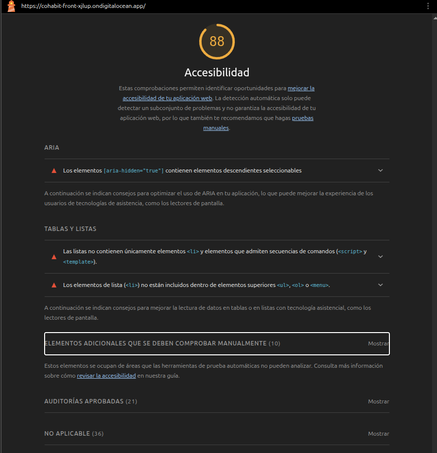
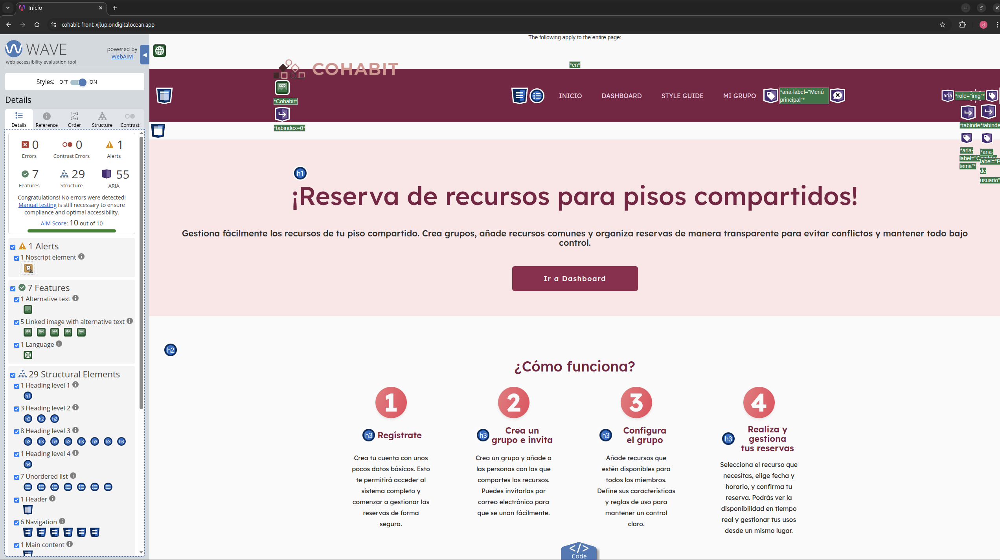
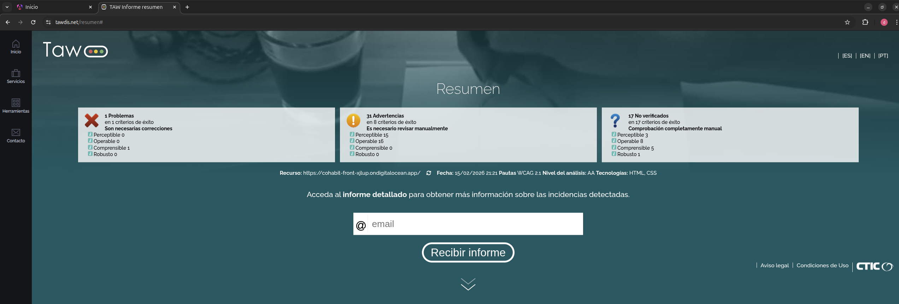
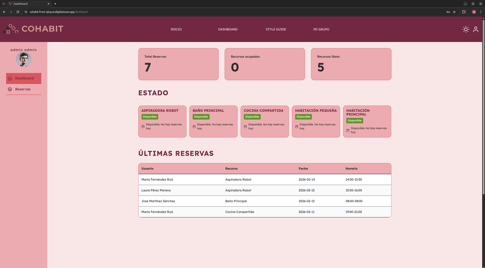
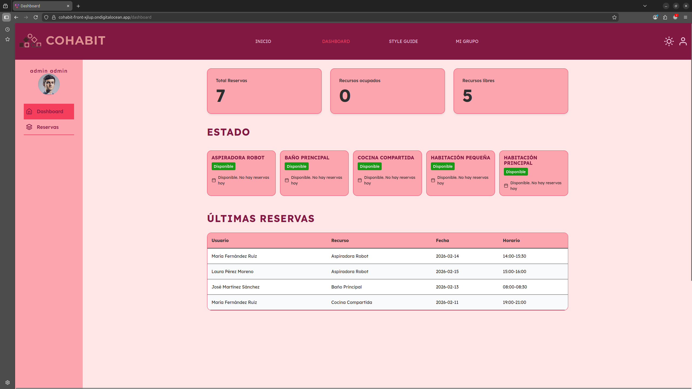
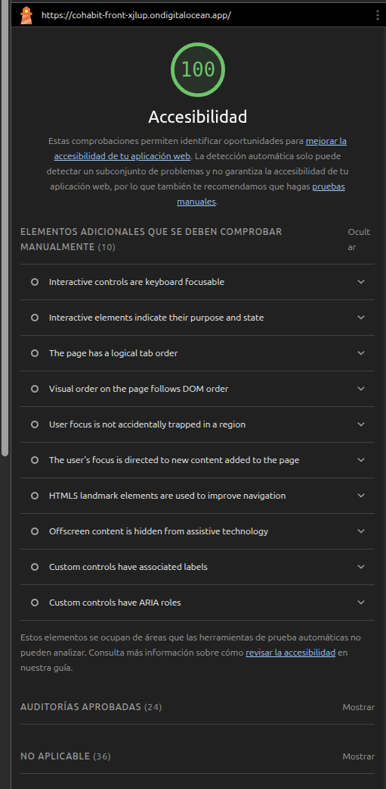
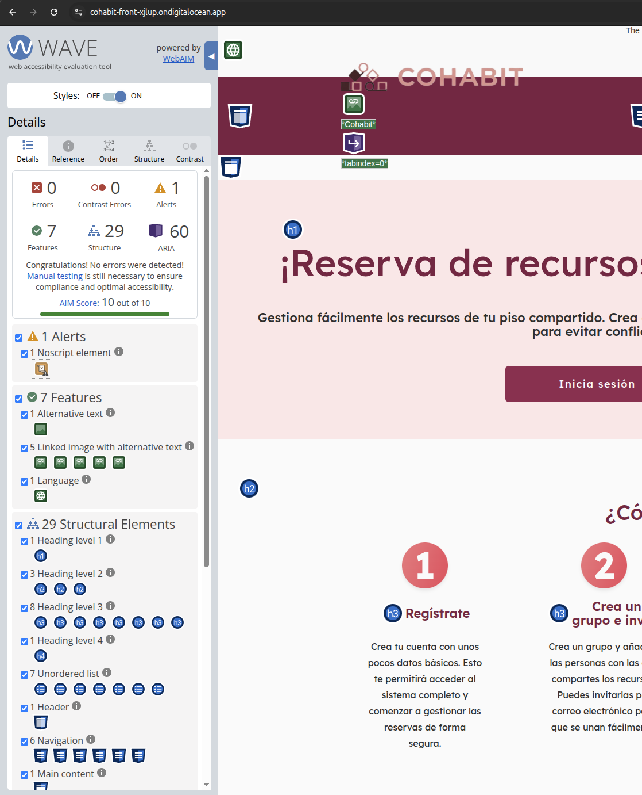

# Accesibilidad

## Sección 1: Fundamentos de accesibilidad

### ¿Por qué es necesaria la accesibilidad web?

La accesibilidad web garantiza que todas las personas, independientemente de sus capacidades, puedan usar, comprender y participar en servicios digitales. Facilita el acceso a información y trámites, reduciendo barreras sociales, ofreciendo acceso igualitario e igualdad de oportunidades. Es un requisito muy importante de usabilidad e igualdad. 

La accesibilidad mejora la usabilidad general: contenidos más claros, navegación más sencilla y compatibilidad con distintos dispositivos mejora la experiencia para todos los usuarios, no solo a personas con discapacidad. Esto incluye también a personas con discapacidad como para mayores, personas en zonas rurales o en países en desarrollo. Además también beneficia a personas en diferentes situaciones como:

- Uso de diferentes tamaños de pantalla.
- Uso en la luz o en la oscuridad.
- Uso con conexión lenta.
- Uso de diferentes periféricos de entrada.

Y más. Existen muchos tipos de discapacidad, estos son algunos de ellos:
- Visual: engloba cualquier alteración en el sentido de la vista, pudiendo ser ceguera total, baja visión o daltonismo.
- Auditiva: es la condición que puede afectar a la capacidad de una persona para escuchar. Puede ser sordera parcial o total.
- Motora: dificultades para moverse o coordinarse.
- Cognitiva: afecta a los procesos que usamos para pensar y recordar. Dificultades de atención, memoria, razonamiento o resolución de problemas.


### Obligatoriedad legal en España/Europa

#### Europa 
La Unión Europea ha aprobado varias directivas y normas que establecen requisitos de accesibilidad. Las más relevantes son:
- `EN 301 549`: es una norma europea armonizada voluntaria con un amplio conjunto de requisitos, creada originalmente para proporcionar requisitos de accesibilidad para todos los productos y servicios TIC. Sirve como referencia técnica para cumplir las directivas europeas y proporciona criterios detallados basados en los principios WCAG.
- `Directiva (UE) 2016/2102` (Web Accessibility Directive): obliga a que los sitios web y las aplicaciones móviles del sector público sean accesibles y exige la publicación de declaraciones de accesibilidad y la realización de controles periódicos y planes de remediación.
- `Directiva (UE) 2019/882`  European Accessibility Act (EAA): establece requisitos de accesibilidad para determinados productos y servicios en el mercado (por ejemplo, ordenadores, teléfonos, servicios de banca en línea, e‑comercio, libros electrónicos). Entro en vigor para todos sus miembros en junio de 2025.


#### España

El 28 de junio de 2025 entró en vigor la European Accessibility Act en España (transpuesta como `Ley 11/2023`) y por primera vez las empresas privadas tienen la obligación legal de garantizar que sus productos digitales sean accesibles. También existen las siguientes leyes: 
- `Ley 34/2002`: Los sitios web del sector público deben ser accesibles.
- `Ley 51/2003`: Prohíbe la discriminación por motivos de discapacidad en:
	- Telecomunicaciones y sociedad de la información.
	- Espacios públicos urbanos, infraestructuras y edificios
	- Transporte.
	- Bienes y servicios a disposición del público.
	- Relaciones con los órganos de la Administración Pública.
- `Real Decreto 1112/2018`: Los sitios web y las aplicaciones móviles del sector público deben ser accesibles.


### Principios WCAG 2.1

1. **Perceptible:** La información y los componentes de la interfaz deben presentarse de formas que los usuarios puedan percibir. Proporcionando alternativas textuales a elementos multimedia, contenido adaptable y distinguible. 
	- Ejemplo: Las imágenes usadas de todo el proyecto incluyen texto alternativo descriptivo para usuarios que usan lectores de pantalla.

2. **Operable:** Los componentes de la interfaz y la navegación deben ser operables por el usuario. Facilita la experiencia del usuario, funcionalidades accesibles (por teclado, diferentes maneras para introducir información..) y, contenido navegable y no perjudicial para la salud.
	- Ejemplo: Todos los enlaces y funcionalidades se pueden acceder por teclado (tabulación) sin depender del ratón.

3. **Comprensible:** La información y el funcionamiento de la interfaz deben ser comprensibles. El contenido debe ser fácil de leer, entender y predecir. Además de ayuda en la introducción de datos para evitar errores. 
	- Ejemplo: Los formularios muestran etiquetas claras, instrucciones breves y mensajes de error fáciles de entender. Así como colores para dar más visibilidad y comprensión al usuario.

4. **Robusto:** El contenido debe ser lo suficientemente robusto como para ser compatible con las herramientas de usuario actuales y futuras.
	- Ejemplo: Uso de HTML semántico y roles ARIA donde procede para que lectores de pantalla y navegadores antiguos interpreten correctamente la página.

### Niveles de conformidad

- Nivel A: requisitos básicos de accesibilidad (mínimos esenciales) que deben ser implementados para garantizar que un sitio web sea usable por personas con discapacidades.
- Nivel AA: incluye todos los criterios del nivel A, además de requisitos adicionales que abordan problemas de accesibilidad más comunes y significativos. Es el objetivo habitual para proyectos y normativa, está diseñado para ser el estándar mínimo para alcanzar una buena accesibilidad web.
- Nivel AAA: representa el grado más alto de accesibilidad web, seguir este nivel significa cumplir con los estándares más exigentes y abordar una amplia gama de necesidades especiales y situaciones.

**Objetivo del proyecto**: alcanzar el nivel AA de conformidad WCAG 2.1.

## Sección 2: Componente multimedia implementado

El componente multimedia implementado es un carrusel.

Este componente se ha incluido en el dashboard (`/dashboard`) y muestra una lista de hasta 5 cards informativas de recursos (nombre, estado, próxima reserva). Tiene botones, en forma de icono de "flecha", en los extremos de la lista para poder moverse en el carrusel. Se elegió para el dashboard porque es un espacio destinado a mostrar información breve y directa sobre el estado del usuario. Por lo que la lista de recursos no debe exceder la altura establecida del componente, por ello se optó implementar un carrusel que mantiene ocultos los recursos adicionales.

### Características de accesibilidad implementadas

1. **Estructura semántica y roles ARIA**: El carrusel utiliza elementos HTML semánticos y roles ARIA apropiados. Se implementa `role="region"` para delimitar la región del carrusel con `aria-label="Carrusel de estado de recursos"` que identifica su propósito. El contenedor de recursos visibles usa `role="group"` con un label dinámico que indica la posición actual ("Mostrando recursos X a Y de Z"). Cada tarjeta de recurso incluye `role="article"` con su propio `aria-label` descriptivo. Esto permite a los lectores de pantalla comprender la estructura y navegar eficientemente por el contenido.

2. **Navegación por teclado optimizada**: Los botones de navegación (anterior/siguiente) son completamente accesibles por teclado. Se puede usar la tecla Tab para navegar entre controles y Enter/Espacio para activarlos. Los botones incluyen estados `:focus-visible` con outline de alto contraste (4px sólido en color primario) y offset de 2px para máxima visibilidad. Cuando un botón está deshabilitado (inicio o fin del carrusel), se establece el atributo `aria-disabled` además del atributo nativo `disabled`, proporcionando información de estado tanto visual como programática.

3. **Actualizaciones dinámicas anunciadas**: Se implementan regiones `aria-live="polite"` y `aria-atomic="true"` para anunciar cambios de contenido a lectores de pantalla sin interrumpir la navegación actual. Hay un elemento adicional con clase `.solo-lectores` (solo visible para lectores de pantalla) que anuncia la posición actual del carrusel cada vez que cambia. Esto garantiza que usuarios de tecnologías asistivas sean informados sobre qué recursos se están mostrando sin necesidad de explorar manualmente toda la interfaz.

4. **Estados visuales claros y distinguibles**: Los botones de navegación implementan múltiples estados visuales para diferentes interacciones. Estado hover: aumento de escala (105%), sombra media, color primario en borde e icono. Estado focus: outline prominente de 4px con sombra grande. Estado active: reducción de escala (95%) para feedback táctil. Estado disabled: opacidad reducida (70%), cursor no permitido, y pointer-events desactivado. Todos los estados usan transiciones suaves (300ms ease-in-out) siguiendo las variables del proyecto.

5. **Iconos decorativos marcados correctamente**: Los iconos de flecha (chevron-left y chevron-right) en los botones de navegación incluyen `aria-hidden="true"`, indicando que son puramente decorativos. La información se proporciona mediante los atributos `aria-label` de los botones ("Ver recursos anteriores" / "Ver recursos siguientes"), evitando redundancia y verbosidad para usuarios de lectores de pantalla.

6. **Diseño responsive y adaptativo**: El carrusel se adapta a diferentes tamaños de pantalla manteniendo la accesibilidad. En tablets muestra 3 recursos por página, en móviles 2 recursos. Los botones de navegación reducen su tamaño proporcionalmente (48px → 40px → 36px) pero mantienen el área de interacción mínima recomendada (36px). Los espaciados y gaps se ajustan usando las variables del sistema de diseño, garantizando consistencia visual.

7. **Contraste y legibilidad**: Todos los elementos del carrusel utilizan las variables de color del proyecto que cumplen con WCAG 2.1 nivel AA. Los botones usan colores con contraste adecuado entre fondo, borde y contenido. El estado hover aplica el color primario que tiene suficiente contraste con el fondo. Los estados deshabilitados mantienen legibilidad aunque con opacidad reducida, cumpliendo con los requisitos de contraste mínimo de 3:1 para componentes de interfaz.

8. **Feedback contextual y descriptivo**: Se proporciona información de contexto en múltiples niveles. A nivel de carrusel: label describiendo la región completa. A nivel de grupo: label dinámico con posición actual. A nivel de elemento: cada recurso tiene su propio label identificativo. Los botones tienen labels descriptivos de acción. Todo esto crea una jerarquía de información que facilita la navegación y comprensión para todos los usuarios, especialmente aquellos usando tecnologías asistivas.

## Sección 3: Auditoría automatizada inicial

La página que se ha usado para las capturas de los análisis ha sido la página de inicio.

### Herramientas de análisis

| Herramienta | Puntuación/Errores | Captura |
|-------------|-------------------|---------|
| Lighthouse | 88/100 |  |
| WAVE | 0 errores, 1 alerta |  |
| TAW | 1 problema, 31 alertas |  |

### Problemas más graves detectados

1. **Falta del atributo lang en HTML**: El documento HTML no especifica el idioma principal de la página mediante el atributo `lang="es"`. Este es el único error crítico detectado por TAW. Sin este atributo, los lectores de pantalla no pueden identificar que el contenido está en español. Este problema afecta directamente a la accesibilidad del principio "Comprensible" de WCAG.

2. **Encabezados y etiquetas sin verificar**: Detectaron advertencias relacionadas con encabezados y etiquetas, es la categoría con mayor número de alertas. Es cierto que la jerarquía de encabezados (`<h1>`, `<h2>`, etc.) está mal, porque hay páginas en las que no utilizo encabezados como `<h1>`.

3. **Contraste de color, redimensionamiento de texto y alts**: Se señalan advertencias y elementos sin verificar sobre el contraste. Detectaron errores de advertencias sobre la capacidad de redimensionar sin pérdida de funcionalidad o contenido. Además, identificaron advertencias sobre que algunos elementos multimedia podrían no tener textos alternativos perceptibles o comprensibles.

## Sección 4: Análisis y corrección de errores

### Tabla resumen de errores

| # | Error | Criterio WCAG | Herramienta | Solución aplicada |
|---|-------|---------------|-------------|-------------------|
| 1 | Falta del atributo lang en el elemento HTML | 3.1.1 - Idioma de la página | TAW | Cambié a `lang="es"` en el elemento `<html>` del `index.html` para indicar el idioma principal de la página. |
| 2 | Falta de encabezado H1 en algunas páginas | 2.4.6 - Encabezados y etiquetas | TAW | Añadí un `<h1>` representativo en cada página para proporcionar un título principal claro. |
| 3 | Jerarquía de encabezados incorrecta (saltos de nivel) | 1.3.1 - Información y relaciones | TAW | Corregí la jerarquía de encabezados añadiendo encabezados en las páginas que tienen saltos de nivel entre los encabezados |
| 4 | Contraste insuficiente en algunos elementos de texto | 1.4.3 - Contraste mínimo | TAW | Ajusté las variables de color y estilos para cumplir WCAG AA. |
| 5 | Textos alternativos ausentes o poco descriptivos en imágenes | 1.1.1 - Contenido no textual | TAW/WAVE | Cambié a `alt` descriptivos y contextuales |
| 6 | Estructura de lista y accesibilidad del componente de 'característica' | 1.3.1 - Información y relaciones; 4.1.1 - Procesamiento (HTML válido -> li características) | Lighthouse | Modifiqué el HTML de la página de inicio, agrupando los componentes mediante `<li>` y cambie la etiqueta interna del componente de un li a un div (decorativo) |

### Detalle de los errores

#### Error #1: Falta del atributo lang en el elemento HTML

**Problema:** La etiqueta `<html>` no tiene el atributo `lang="es"` que indica que la página está en español. Este fue el único error crítico que encontró TAW.

**Impacto:** Los lectores de pantalla no pueden identificar el idioma del contenido, lo que provoca que pronuncien las palabras incorrectamente usando reglas fonéticas de otro idioma (generalmente inglés por defecto). Esto dificulta gravemente la comprensión para usuarios con discapacidad visual que dependen de estas tecnologías asistivas.

**Criterio WCAG:** 3.1.1 - Idioma de la página (Nivel A)

**Código ANTES:**
```html
<!doctype html>
<html lang="en"> <!-- Aquí -->
<head>
  <meta charset="utf-8">
  <title>Frontend</title>
  <base href="/">
  <meta name="viewport" content="width=device-width, initial-scale=1">
</head>
<body>
  <app-root></app-root>
</body>
</html>
```

**Código DESPUÉS:**
```html
<!doctype html>
<html lang="es"> <!-- Idioma principal establecido a español -->
<head>
  <meta charset="utf-8">
  <title>Frontend</title>
  <base href="/">
  <meta name="viewport" content="width=device-width, initial-scale=1">
</head>
<body>
  <app-root></app-root>
</body>
</html>
```

#### Error #2: Falta de encabezado H1 en algunas páginas

**Problema:** Hay páginas que no tienen ningún `<h1>`, lo que significa que no hay un título principal claro. TAW me alertó con 13 advertencias sobre encabezados, siendo el problema más repetido.

**Impacto:** Los usuarios de lectores de pantalla suelen presionar la tecla "1" para ir directamente al título principal de la página y entender de qué va. Si no hay `<h1>`, no saben dónde están ni qué contenido verán. Es como entrar a una habitación sin letrero en la puerta.

**Criterio WCAG:** 2.4.6 - Encabezados y etiquetas (Nivel AA)

**Código ANTES:**

Se añadió `<h1>` en varias páginas que no tenían encabezado principal:

1. Página de recursos disponibles:
```html
<!-- src/app/pages/recursos/recursos.html -->
<section class="recursos">
  <h2 class="recursos__titulo">RECURSOS DISPONIBLES</h2>
  <!-- Contenido de la página -->
</section>
```

2. Página de reservas del grupo:
```html
<!-- src/app/pages/reservas/reservas.html -->
<section class="reservas">
  <!-- Sin H1, comenzaba directamente con tab y contenido -->
  <app-tab tipo="reservas"></app-tab>
</section>
```

3. Página de mis reservas:
```html
<!-- src/app/pages/mis-reservas/mis-reservas.html -->
<section class="mis-reservas">
  <!-- Sin H1, empezaba directamente con estado de carga -->
  @if (loading()) {
    <section class="mis-reservas__estado">
      <app-spinner></app-spinner>
    </section>
  }
</section>
```

**Código DESPUÉS:**

1. Se cambió `<h2>` a `<h1>` en la página de recursos:
```html
<!-- src/app/pages/recursos/recursos.html -->
<section class="recursos">
  <h1 class="recursos__titulo">RECURSOS DISPONIBLES</h1>
  <!-- Contenido de la página -->
</section>
```

2. Se añadió `<h1>` al inicio de la página de reservas:
```html
<!-- src/app/pages/reservas/reservas.html -->
<section class="reservas">
  <h1 class="reservas__titulo">Reservas del grupo</h1>
  <app-tab tipo="reservas"></app-tab>
  <!-- Resto del contenido -->
</section>
```

3. Se añadió `<h1>` al inicio de la página de mis reservas:
```html
<!-- src/app/pages/mis-reservas/mis-reservas.html -->
<section class="mis-reservas">
  <h1 class="mis-reservas__titulo">Reservas propias en el grupo</h1>
  @if (loading()) {
    <section class="mis-reservas__estado">
      <app-spinner></app-spinner>
    </section>
  }
</section>
```

#### Error #3: Jerarquía de encabezados incorrecta (saltos de nivel)

**Problema:** En la página de recursos salto directamente de un `<h2>` a un `<h3>`, sin ningún contexto intermedio. Además, hay páginas donde empiezo con `<h2>` sin tener un `<h1>`.

**Impacto:** Los lectores de pantalla permiten navegar por niveles de encabezados, y cuando hay saltos, los usuarios se pierden. Además, puede parecer que falta contenido o que algo está mal organizado. También perjudica al SEO de la página.

**Criterio WCAG:** 1.3.1 - Información y relaciones (Nivel A)

**Código ANTES:**
```html
<!-- src/app/pages/recursos/recursos.html - Saltos de nivel -->
<section class="recursos">
  <h2 class="recursos__titulo">RECURSOS DISPONIBLES</h2>  <!-- Sin H1 previo -->

  @if (recursos.length === 0) {
    <aside class="recursos__vacio">
      <h3 class="recursos__vacio__titulo">No hay recursos disponibles</h3>  <!-- Salta de H2 a H3 -->
      <p class="recursos__vacio__texto">Comienza creando tu primer recurso</p>
    </aside>
  }

  @if (recursos.length > 0 && recursosFiltrados.length === 0) {
    <aside class="recursos__vacio">
      <h3>No se encontraron resultados</h3>  <!-- Otro H3 sin jerarquía -->
      <p>Intenta ajustar tus filtros de búsqueda</p>
    </aside>
  }
</section>
```
  
  <h3>Sala de reuniones</h3>
  <p>Estado: Ocupada</p>
</div>
```

**Código DESPUÉS:**
```html
<section class="recursos">
  <h1 class="recursos__titulo">RECURSOS DISPONIBLES</h1>

  @if (recursos.length === 0) {
    <aside class="recursos__vacio">
      <h3 class="recursos__vacio__titulo">No hay recursos disponibles</h3>
      <p class="recursos__vacio__texto">Comienza creando tu primer recurso</p>
    </aside>
  }

  @if (recursos.length > 0 && recursosFiltrados.length === 0) {
    <aside class="recursos__vacio">
      <h3>No se encontraron resultados</h3>
      <p>Intenta ajustar tus filtros de búsqueda</p>
    </aside>
  }
</section>
```

#### Error #4: Contraste insuficiente en algunos elementos de texto

**Problema:** Algunos textos tienen colores demasiado claros sobre fondos claros, especialmente en las variables de grises que uso en el proyecto. TAW marcó 3 elementos. Los grises claros como `$gris2` (75% de luminosidad) y `$gris3` (64%) no tienen suficiente contraste sobre fondo blanco.

**Impacto:** Las personas con baja visión, daltonismo o incluso alguien mirando la pantalla bajo el sol no puede leer bien el texto. He notado esto especialmente en textos secundarios o placeholders que puse en gris claro pensando que se verían bien.

**Criterio WCAG:** 1.4.3 - Contraste mínimo (Nivel AA)

**Código ANTES:**
```scss
// src/styles/00-settings/_variables.scss
// Escala de grises (NEUTROS)
$blanco-puro: hsl(0, 0%, 100%);
$blanco: hsl(0, 0%, 98%);
$gris1: hsl(0, 0%, 89%);
$gris2: hsl(0, 0%, 75%);  // Puede tener contraste insuficiente
$gris3: hsl(0, 0%, 64%);  // Contraste bajo sobre fondo claro
$gris4: hsl(0, 0%, 50%);
$gris5: hsl(0, 0%, 38%);
$gris6: hsl(0, 0%, 25%);
$negro: hsl(0, 0%, 13%);

// Ejemplo de uso problemático
.texto-secundario {
  color: $gris2;  // 75% luminosidad = contraste 3:1 (insuficiente)
  background-color: $blanco-puro;
}
```

**Código DESPUÉS:**
```scss
$gris2: hsl(0, 0%, 60%);  // Ajustado para mejorar contraste (de 75% a 60%)
$gris3: hsl(0, 0%, 52%);  // Ajustado para mejorar contraste (de 64% a 52%)
```

#### Error #5: Textos alternativos ausentes o poco descriptivos en imágenes

**Problema:** Tengo varias imágenes con descripciones genéricas que no aportan contexto. TAW encontró 6 casos así y WAVE también me avisó. Por ejemplo, en las cards de recursos uso `alt="Recurso"` cuando no hay nombre, y en algunos componentes uso `alt="Foto de perfil"` o `alt="Vista previa"` sin más detalles.

**Impacto:** Un usuario con lector de pantalla no tiene ni idea de qué hay en la imagen. Escucha algo genérico como "Recurso" o "Foto de perfil" sin más contexto.

**Criterio WCAG:** 1.1.1 - Contenido no textual (Nivel A)

**Código ANTES:**
```html
<!-- src/app/components/shared/card-recurso/card-recurso.html -->
<article class="card-recurso">
  <div class="card-recurso__imagen-contenedor">
    @if (recurso.fotoRecurso) {
      <!-- Alt genérico que no describe el recurso específico -->
        <!-- Si no hay nombre, dice "Recurso" -->
    }
  </div>
  <h3 class="card-recurso__titulo">{{ recurso.nombre || 'Sin nombre' }}</h3>
</article>

<!-- src/app/components/pages/data-perfil/data-perfil.html -->
<div class="perfil__foto">
  <!-- Alt genérico sin especificar usuario -->
  
</div>

<!-- src/app/components/shared/form-archivo/form-archivo.html -->
<!-- Alt demasiado genérico para la preview -->

```

**Código DESPUÉS:**
```html
<!-- Ejemplos de 'DESPUÉS' con `alt` mejorados -->
<!-- src/app/components/shared/card-recurso/card-recurso.html -->
<article class="card-recurso">
  <div class="card-recurso__imagen-contenedor">
    @if (recurso.fotoRecurso) {
      
    }
  </div>
  <h3 class="card-recurso__titulo">{{ recurso.nombre || 'Sin nombre' }}</h3>
</article>

<!-- src/app/components/pages/data-perfil/data-perfil.html -->
<figure class="data-perfil__foto">
  @if (usuario?.fotoPerfil) {
    
  }
</figure>

<!-- src/app/components/shared/form-archivo/form-archivo.html -->
<figure class="subida-archivo__contenedor-previa">
  
</figure>

<!-- Otros ejemplos: card genérica, miembro y sidebar -->
<!-- src/app/components/shared/card/card.html -->


<!-- src/app/components/shared/card-miembro/card-miembro.html -->


<!-- src/app/components/layout/sidebar/sidebar.html -->

```

#### Error #6: Estructura de lista y accesibilidad del componente de 'característica'

**Problema:** Detectó que la lista de características debía tener una estructura semántica clara para que lectores de pantalla y herramientas automáticas la interpreten correctamente. Es necesario asegurarse de que los elementos visuales que representan elementos de una lista sean `<li>`. Yo usaba en el componente la etiqueta `<li>`, pero parece ser que al tener la etiqueta del selector del componente agrupando este los lectores no lo interpretan bien y no detectan que se use li.

**Impacto:** Sin una estructura clara, la navegación por encabezados/listas puede ser confusa para usuarios de tecnologías de asistencia, y Lighthouse/WAVE pueden marcar advertencias sobre listas mal formadas o HTML no conforme.

**Criterios WCAG relevantes:** 1.3.1 - Información y relaciones (Nivel A); 4.1.1 - Procesamiento (HTML válido)

**Código ANTES (patrón problemático):**
```html
<!-- src/app/pages/inicio/inicio.html -->
<!-- Ejemplo de característica: componente dentro de <ul> sin <li> -->
<ul class="caracteristicas__lista">
  <app-caracteristica>Gestión de reservas.</app-caracteristica>
  <app-caracteristica>Vista general de recursos.</app-caracteristica>
</ul>
```

**Código DESPUÉS:**

Ahora lo que hago es agrupar el selector del componente con la etiqueta `<li>`.
```html
<!-- src/app/components/shared/caracteristica/caracteristica.html -->
<ul class="caracteristicas__lista">
  <li class="caracteristica"><app-caracteristica>Gestión de reservas.</app-caracteristica></li>
  <li class="caracteristica"><app-caracteristica>Vista general de recursos.</app-caracteristica></li>
</ul>
```

En el HTML usaba li para agrupar la característica, ahora utilizo un div "decorativo".

```html
<!-- src/app/components/shared/caracteristica/caracteristica.html -->
<div class="caracteristica">
  <span class="caracteristica__icono" aria-hidden="true">
    <div [feather]="icon" class="caracteristica-icono"></span>
  </span>
  <p class="caracteristica__texto"><ng-content></ng-content></p>
</div>
```

## Sección 5: Análisis de estructura semántica

### Landmarks HTML5 utilizados

- [x] `<header>` - Cabecera principal del sitio con logo, navegación y botones. Además de encabezados para algunas cards.
- [x] `<nav>` - Menú de navegación.
- [x] `<main>` - Contenido principal.
- [x] `<article>` - Usado principalmente para las cards.
- [x] `<section>` - Usado para dividir múltiples secciones de contenido en todas las páginas.
- [x] `<aside>` - Sidebar principalmente y elementos que aportan información al contenido principal. 
- [x] `<footer>` - Pie de página principal del sitio.

### Jerarquía de encabezados

```
H1: [Título principal]
  H2: [Sección 1]
    H3: [Subsección 1.1]
    H3: [Subsección 1.2]
  H2: [Sección 2]
    H3: [Subsección 2.1]
```

### Análisis de imágenes

- **Total de imágenes:** 13
- **Con texto alternativo:** 13
- **Decorativas (alt=""):** 0
- **Sin alt (corregidas):** 0 (todas tienen `alt`, pero varios son genéricos)

**Detalle de imágenes encontradas (por archivo y estado del `alt`):**
1. `src/app/components/layout/header/header.html` - `header/logo.svg` - `alt="Cohabit"` — OK (marca)
2. `src/app/pages/inicio/inicio.html` - `img_optimizadas/inicio-lg.jpg` - `alt="Vista general de la aplicación Cohabit"` — OK (descriptiva)
3. `src/app/components/layout/footer/footer.html` - `footer/youtube.svg` - `alt="YouTube"` — OK
4. `src/app/components/layout/footer/footer.html` - `footer/facebook.svg` - `alt="Facebook"` — OK
5. `src/app/components/layout/footer/footer.html` - `footer/x.svg` - `alt="Twitter/X"` — OK
6. `src/app/components/layout/footer/footer.html` - `footer/instagram.svg` - `alt="Instagram"` — OK
7. `src/app/components/pages/data-perfil/data-perfil.html` - `usuario?.fotoPerfil` - `alt="Foto de perfil"` — genérico
8. `src/app/components/pages/data-grupo/data-grupo.html` - `grupo?.fotoGrupo` - `alt="Foto del grupo"` — genérico
9. `src/app/components/shared/form-archivo/form-archivo.html` - `previewUrl` - `alt="Vista previa"` — genérico
10. `src/app/components/shared/card-recurso/card-recurso.html` - `recurso.fotoRecurso` - `[alt]="recurso.nombre || 'Recurso'"` — dinámico con fallback genérico
11. `src/app/components/shared/card/card.html` - `[alt]="imagenAlt || titulo"` — dinámico (fallback depende de `titulo`)
12. `src/app/components/shared/card-miembro/card-miembro.html` - `[alt]="'Foto de perfil de ' + (usuario?.nombre || 'usuario')"` — dinámico (fallback `'usuario'` es genérico)
13. `src/app/components/layout/sidebar/sidebar.html` - `[alt]="nombreUsuario()"` — dinámico (puede devolver valor genérico/vacío)

Todas las imágenes tienen el atributo alt, cumpliendo técnicamente con el requisito básico. Sin embargo, TAW detectó 6 advertencias porque algunos textos alternativos son demasiado genéricos y no proporcionan suficiente contexto. Las imágenes estáticas (logo, redes sociales, hero) tienen descripciones adecuadas. Las imágenes dinámicas (perfiles, recursos, grupos) necesitan descripciones más específicas que incluyan el nombre del usuario/recurso/grupo para ser verdaderamente descriptivas.

## Sección 6: Verificación manual

### 6.1 Test de navegación por teclado

**Herramienta utilizada:** Navegación nativa del navegador

**Checklist de navegación:**

- [ ] Puedo llegar a todos los enlaces y botones con Tab
- [ ] El orden de navegación con Tab es lógico (no salta caóticamente)
- [ ] Veo claramente qué elemento tiene el focus (borde, sombra, color)
- [ ] Puedo usar mi componente multimedia solo con teclado
- [ ] No hay "trampas" de teclado donde quedo bloqueado
- [ ] Los menús/modals se pueden cerrar con Esc (si aplica)

**Problemas encontrados:** [Descripción detallada de problemas o "Ninguno"]

**Soluciones aplicadas:** [Qué cambios se implementaron para resolver los problemas]

### 6.2 Test con lector de pantalla

**Herramienta utilizada:** [NVDA (Windows) / VoiceOver (Mac) / ChromeVox]

**Evaluación de accesibilidad:**

| Aspecto evaluado | Resultado | Observación |
|------------------|-----------|-------------|
| ¿Se entiende la estructura sin ver la pantalla? | [✅ / ⚠️ / ❌] | [Comentario sobre estructura y navegación] |
| ¿Los landmarks se anuncian correctamente? | [✅ / ⚠️ / ❌] | [Comentario sobre landmarks] |
| ¿Las imágenes tienen descripciones adecuadas? | [✅ / ⚠️ / ❌] | [Comentario sobre imágenes] |
| ¿Los enlaces tienen textos descriptivos? | [✅ / ⚠️ / ❌] | [Comentario sobre enlaces] |
| ¿El componente multimedia es accesible? | [✅ / ⚠️ / ❌] | [Comentario sobre el carrusel] |

**Principales problemas detectados:**
1. [Problema 1]
2. [Problema 2]
3. [Problema 3]

**Mejoras aplicadas:**
1. [Mejora 1]
2. [Mejora 2]
3. [Mejora 3]

### 6.3 Verificación cross-browser

**Navegadores evaluados:**

| Navegador | Versión | Layout correcto | Multimedia funciona | Observaciones |
|-----------|---------|-----------------|---------------------|---------------|
| Chrome | [XXX] | [✅ / ⚠️ / ❌] | [✅ / ⚠️ / ❌] | [Problemas detectados o "Sin problemas"] |
| Firefox | [XXX] | [✅ / ⚠️ / ❌] | [✅ / ⚠️ / ❌] | [Problemas detectados o "Sin problemas"] |
| Safari/Edge | [XXX] | [✅ / ⚠️ / ❌] | [✅ / ⚠️ / ❌] | [Problemas detectados o "Sin problemas"] |

**Capturas de pantalla:**
- Chrome: 
- Firefox: 
- Safari/Edge: 

## Sección 7: Resultados finales después de correcciones

### Comparativa de resultados

| Herramienta | Antes | Después | Mejora |
|-------------|-------|---------|--------|
| Lighthouse | 88/100 | 100/100 | +12 puntos (0 errores)|
| WAVE | 0 errores, 1 alerta | 0 errores, 0 alertas | -1 alerta (0 errores como antes) |
| TAW | 1 problema | 0 problemas | -1 problema |

### Capturas finales

- Lighthouse después: 
- WAVE después: 

### Checklist de conformidad WCAG 2.1 Nivel AA

**Perceptible:**
- [x] 1.1.1 - Contenido no textual (alt en imágenes)
- [x] 1.3.1 - Información y relaciones (HTML semántico)
- [x] 1.4.3 - Contraste mínimo (4.5:1 en texto normal)
- [x] 1.4.4 - Redimensionar texto (200% sin pérdida de funcionalidad)

**Operable:**
- [x] 2.1.1 - Teclado (toda la funcionalidad accesible)
- [x] 2.1.1 - Teclado (toda la funcionalidad accesible)
- [ ] 2.1.2 - Sin trampas de teclado
- [x] 2.4.3 - Orden del foco (lógico y predecible)
- [x] 2.4.7 - Foco visible (se ve claramente)

**Comprensible:**
- [x] 3.1.1 - Idioma de la página (atributo lang="es")
- [x] 3.2.3 - Navegación consistente
- [x] 3.3.2 - Etiquetas o instrucciones en formularios

**Robusto:**
- [x] 4.1.2 - Nombre, función, valor (ARIA cuando necesario)

### Nivel de conformidad alcanzado

**Nivel alcanzado:** AA (parcial)

**Justificación y excepción:** El proyecto cumple la mayoría de los criterios de éxito del nivel AA de WCAG 2.1 evaluados y se han corregido la mayoría de los errores principales detectados inicialmente (idioma de página, jerarquía de encabezados, contraste de color, textos alternativos y estructura de listas) y otros de otras páginas.


