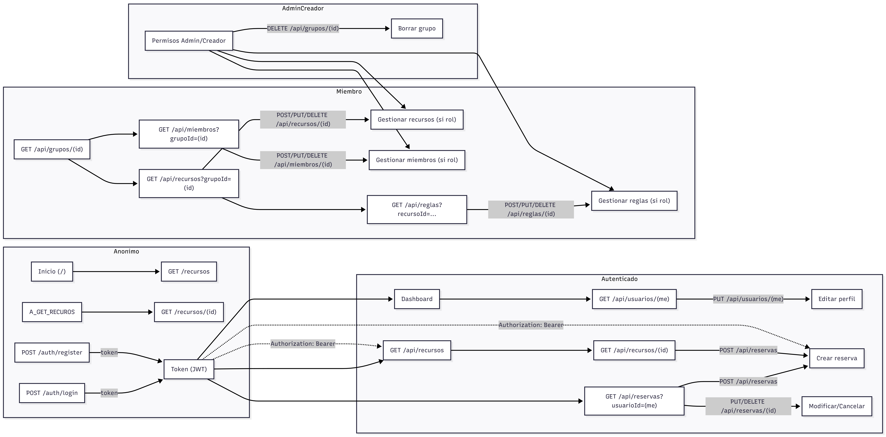

# Fase 5: Servicios y comunicación HTTP

## Índice

1. [Descripción General](#descripción-general)
2. [Arquitectura de Servicios](#arquitectura-de-servicios)
3. [Catálogo de Endpoints](#catálogo-de-endpoints)
4. [Interfaces TypeScript](#interfaces-typescript)
5. [Estrategia de Manejo de Errores](#estrategia-de-manejo-de-errores)
6. [Diagrama de Flujo de Peticiones HTTP](#diagrama-de-flujo-de-peticiones-http)

## Descripción general

Esta fase implementa la capa de servicios HTTP del frontend Angular, que se encarga de toda la comunicación con el backend Spring Boot. La arquitectura está diseñada para ser:

- **Modular**: Cada entidad tiene su propio servicio dedicado
- **Reutilizable**: Servicio base `ApiService` centraliza lógica común
- **Tipada**: Todas las peticiones y respuestas están fuertemente tipadas con TypeScript
- **Resiliente**: Manejo centralizado de errores y reintentos automáticos
- **Segura**: Interceptores para autenticación JWT automática

### Características principales

- Servicios CRUD completos para todas las entidades
- Interceptor de autenticación JWT automático
- Manejo de errores centralizado y clasificado por tipo
- Paginación compatible con Spring Data Page
- Reintentos automáticos en peticiones GET
- Tipado estricto con interfaces TypeScript

## Arquitectura de servicios

```
frontend/src/app/
├── services/
│   ├── api.service.ts              # Servicio base HTTP
│   ├── auth.service.ts             # Autenticación (login, register, logout)
│   ├── usuario.service.ts          # CRUD Usuarios
│   ├── grupo.service.ts            # CRUD Grupos
│   ├── recurso.service.ts          # CRUD Recursos
│   ├── reserva.service.ts          # CRUD Reservas
│   ├── miembro-grupo.service.ts    # CRUD Miembros de Grupo
│   ├── regla-recurso.service.ts    # CRUD Reglas de Recursos
│   ├── notificacion.service.ts     # Sistema de notificaciones visuales
│   ├── modal.service.ts            # Gestión de modales
│   ├── redireccion.service.ts      # Redirecciones con estado
│   └── error-handler.util.ts       # Utilidad de manejo de errores
│
├── core/
│   └── interceptors/
│       ├── auth.interceptor.ts     # Interceptor JWT
│       ├── error.interceptor.ts    # Interceptor global de errores
│       └── logging.interceptor.ts  # Interceptor de logging HTTP
│
└── models/
    ├── auth.models.ts              # Interfaces de autenticación
    ├── backend-types.ts            # Tipos del backend
    ├── api-list-response.model.ts  # Respuesta de listas
    ├── usuario.model.ts            # Interfaces de Usuario
    ├── grupo.model.ts              # Interfaces de Grupo
    ├── recurso.model.ts            # Interfaces de Recurso
    ├── reserva.model.ts            # Interfaces de Reserva
    ├── miembro-grupo.model.ts      # Interfaces de MiembroGrupo
    └── regla-recurso.model.ts      # Interfaces de ReglaRecurso
```

### Servicio base: ApiService

El `ApiService` centraliza toda la lógica de peticiones HTTP y proporciona métodos genéricos reutilizables.

```typescript
@Injectable({ providedIn: 'root' })
export class ApiService {
  private readonly baseUrl = 'http://localhost:4200';

  // Métodos genéricos con manejo de errores integrado
  get<T>(endpoint: string, options?: { params?: HttpParams; headers?: HttpHeaders; [key: string]: any }): Observable<T>
  post<T>(endpoint: string, body: unknown, options?: { params?: HttpParams; headers?: HttpHeaders; [key: string]: any }): Observable<T>
  put<T>(endpoint: string, body: unknown, options?: { params?: HttpParams; headers?: HttpHeaders; [key: string]: any }): Observable<T>
  delete<T>(endpoint: string, options?: { params?: HttpParams; headers?: HttpHeaders; [key: string]: any }): Observable<T>

  // Métodos auxiliares para subir archivos (FormData)
  subirArchivo<T>(endpoint: string, archivo: File, camposAdicionales?: { [k: string]: string | Blob }, metodo: 'POST' | 'PUT' = 'POST', options?: { params?: HttpParams; headers?: HttpHeaders; [key: string]: any }): Observable<T>
  subirMultiplesArchivos<T>(endpoint: string, archivos: File[], camposAdicionales?: { [k: string]: string | Blob }, metodo: 'POST' | 'PUT' = 'POST', options?: { params?: HttpParams; headers?: HttpHeaders; [key: string]: any }): Observable<T>
}
```

**Características**:
- URL base centralizada
- Manejo automático de errores con `catchError`
- Soporte para `options` (query `params` y `headers`) en todas las llamadas
- Métodos para subir `FormData` que aceptan `options
- Tipado genérico para respuestas

## Catálogo de endpoints

### Autenticación (`auth.service.ts`)

| Método | Endpoint | Descripción | Request Body | Response | Observaciones |
|--------|----------|-------------|--------------|----------|---------------|
| POST | `/auth/login` | Iniciar sesión | `LoginRequest` | `AuthResponse` | Devuelve token JWT |
| POST | `/auth/register` | Registrar usuario | `RegisterRequest` | `AuthResponse` | Crea usuario y devuelve token |

**URL Base**: `http://localhost:8080/auth`

**Interfaces**:
```typescript
interface LoginRequest {
  email: string;
  password: string;
}

interface RegisterRequest {
  nombre: string;
  apellidos: string;
  email: string;
  password: string;
}

interface AuthResponse {
  token: string;
}
```

### Usuarios (`usuario.service.ts`)

| Método | Endpoint | Descripción | Parámetros | Respuesta |
|--------|----------|-------------|------------|----------|
| GET | `/api/usuarios/{id}` | Obtener usuario por ID | `id: number` | `UsuarioResponse` |
| GET | `/api/usuarios` | Listar usuarios paginados | `page, size, sort?` (query) | `ApiListResponse<UsuarioResponse>` |
| POST | `/api/usuarios` | Crear usuario | `UsuarioRequest` (body) | `UsuarioResponse` |
| PUT | `/api/usuarios/{id}` | Actualizar usuario | `id: number`, `UsuarioUpdate` (body) | `UsuarioResponse` |
| DELETE | `/api/usuarios/{id}` | Eliminar usuario | `id: number` | `void` |

**URL Base**: `/api/usuarios` (relativa a `baseUrl`)

### Grupos (`grupo.service.ts`)

| Método | Endpoint | Descripción | Parámetros | Respuesta |
|--------|----------|-------------|------------|----------|
| GET | `/api/grupos/{id}` | Obtener grupo por ID | `id: number` | `GrupoResponse` |
| GET | `/api/grupos` | Listar grupos paginados o filtrados | `page, size, sort?, nombre?, descripcion?, creadorId?` (query) | `ApiListResponse<GrupoResponse>` |
| POST | `/api/grupos` | Crear grupo | `GrupoRequest` (body) | `GrupoResponse` |
| PUT | `/api/grupos/{id}` | Actualizar grupo | `id: number`, `GrupoUpdate` (body) | `GrupoResponse` |
| DELETE | `/api/grupos/{id}` | Eliminar grupo | `id: number` | `void` |

**Parámetros de ordenamiento**:
- `sort`: String con formato `campo,dirección` (ej: `nombre,asc`)

**Búsqueda filtrada**: cuando se usan filtros (`nombre`, `descripcion`, `creadorId`) el frontend hace la petición a `/api/grupos/buscar`.

### Recursos (`recurso.service.ts`)

| Método | Endpoint | Descripción | Parámetros | Respuesta |
|--------|----------|-------------|------------|----------|
| GET | `/api/recursos/{id}` | Obtener recurso por ID | `id: number` | `RecursoResponse` |
| GET | `/api/recursos` | Listar recursos paginados o filtrados | `page, size, grupoId?, tipo?, estado?, fecha?, horaInicio?, horaFin?` (query). Si se pasan filtros el endpoint usado es `/api/recursos/buscar`. | `ApiListResponse<RecursoResponse>` |
| POST | `/api/recursos` | Crear recurso | `RecursoRequest` (body) | `RecursoResponse` |
| PUT | `/api/recursos/{id}` | Actualizar recurso | `id: number`, `RecursoUpdate` (body) | `RecursoResponse` |
| DELETE | `/api/recursos/{id}` | Eliminar recurso | `id: number` | `void` |

**Filtros disponibles**:
```typescript
interface FiltrosRecurso {
  grupoId?: number;
  tipo?: string;      // Ej: 'HABITACION', 'OBJETO', 'COCINA', 'BAÑO'
  estado?: string;    // Ej: 'DISPONIBLE', 'OCUPADO', 'MANTENIMIENTO'
  fecha?: string;     // Formato ISO: YYYY-MM-DD (filtro de disponibilidad)
  horaInicio?: string; // Formato HH:mm:ss
  horaFin?: string;    // Formato HH:mm:ss
}
```

### Reservas (`reserva.service.ts`)

| Método | Endpoint | Descripción | Parámetros | Respuesta |
|--------|----------|-------------|------------|----------|
| GET | `/api/reservas/{id}` | Obtener reserva por ID | `id: number` | `ReservaResponse` |
| GET | `/api/reservas` | Listar reservas paginadas o filtradas | `page, size, recursoId?, usuarioId?, fecha?, estado?` (query). Si se usan filtros el endpoint es `/api/reservas/buscar`. | `ApiListResponse<ReservaResponse>` |
| POST | `/api/reservas` | Crear reserva | `ReservaRequest` (body) | `ReservaResponse` |
| PUT | `/api/reservas/{id}` | Actualizar reserva | `id: number`, `ReservaUpdate` (body) | `ReservaResponse` |
| DELETE | `/api/reservas/{id}` | Eliminar reserva | `id: number` | `void` |

**Filtros disponibles**:
```typescript
interface FiltrosReserva {
  recursoId?: number;
  usuarioId?: number;
  fecha?: string;     // Formato ISO: YYYY-MM-DD
  estado?: string;    // Ej: 'CONFIRMADA', 'CANCELADA', 'PENDIENTE'
}
```

### Miembros de Grupo (`miembro-grupo.service.ts`)

| Método | Endpoint | Descripción | Parámetros | Respuesta |
|--------|----------|-------------|------------|----------|
| GET | `/api/miembros/{id}` | Obtener miembro por ID | `id: number` | `MiembroGrupoResponse` |
| GET | `/api/miembros` | Listar miembros paginados | `page, size, sort?` (query) | `ApiListResponse<MiembroGrupoResponse>` |
| POST | `/api/miembros` | Agregar miembro al grupo | `MiembroGrupoRequest` (body) | `MiembroGrupoResponse` |
| PUT | `/api/miembros/{id}` | Actualizar miembro | `id: number`, `MiembroGrupoUpdate` (body) | `MiembroGrupoResponse` |
| DELETE | `/api/miembros/{id}` | Eliminar miembro del grupo | `id: number` | `void` |

### Reglas de Recursos (`regla-recurso.service.ts`)

| Método | Endpoint | Descripción | Parámetros | Respuesta |
|--------|----------|-------------|------------|----------|
| GET | `/api/reglas/{id}` | Obtener regla por ID | `id: number` | `ReglaRecursoResponse` |
| GET | `/api/reglas` | Listar reglas paginadas | `page, size, sort?` (query) | `ApiListResponse<ReglaRecursoResponse>` |
| POST | `/api/reglas` | Crear regla | `ReglaRecursoRequest` (body) | `ReglaRecursoResponse` |
| PUT | `/api/reglas/{id}` | Actualizar regla | `id: number`, `ReglaRecursoUpdate` (body) | `ReglaRecursoResponse` |
| DELETE | `/api/reglas/{id}` | Eliminar regla | `id: number` | `void` |


## Interfaces TypeScript

### Interfaces de Paginación

```typescript
// Respuesta del backend de paginación(Spring Data Page)
interface BackendPage<T> {
  content: T[];
  totalElements: number;
}

// Respuesta adaptada para el frontend
interface ApiListResponse<T> {
  items: T[];
  total: number;
}
```

**Transformación**: Los servicios transforman automáticamente `BackendPage` a `ApiListResponse` usando RxJS:

```typescript
map(res => ({ items: res.content, total: res.totalElements }))
```

### Interfaces de Entidades

#### Usuario

##### UsuarioResponse (GET)

Representa los datos de un usuario obtenidos del servidor. Se utiliza como respuesta en operaciones GET (consulta de usuarios). Contiene información completa del perfil del usuario incluyendo datos de contacto y referencias a su membresía de grupo si existe.

```typescript
interface UsuarioResponse {
  id?: number;
  nombre?: string;
  apellidos?: string;
  email?: string;
  fotoPerfil?: string;
  pais?: string;
  ciudad?: string;
  telefono?: string;
  fechaRegistro?: string;
  miembroGrupoId?: number;
}
```

##### UsuarioRequest (POST)

Define los datos necesarios para crear un nuevo usuario. Se utiliza en operaciones POST para el registro de usuarios. Todos los campos básicos (nombre, apellidos, email, password) son obligatorios.

```typescript
export interface UsuarioRequest {
  nombre: string;
  apellidos: string;
  email: string;
  password: string;
  fotoPerfil?: string;
  pais?: string;
  ciudad?: string;
  telefono?: string;
}
```

##### UsuarioUpdate (PUT)

Define los campos modificables de un usuario existente. Se utiliza en operaciones PUT para actualizar información del perfil. Todos los campos son opcionales, permitiendo actualizaciones parciales.

```typescript
export interface UsuarioUpdate {
  nombre?: string;
  apellidos?: string;
  email?: string;
  password?: string;
  fotoPerfil?: string;
  pais?: string;
  ciudad?: string;
  telefono?: string;
}
```

#### Grupo

##### GrupoResponse (GET)

Representa un grupo de convivencia obtenido del servidor. Contiene información completa del grupo incluyendo su configuración, código de invitación, y referencias a miembros y recursos asociados.

```typescript
interface GrupoResponse {
  id?: number;
  nombre?: string;
  direccion?: string;
  descripcion?: string;
  fotoGrupo?: string;
  codigoInvitacion?: string;
  fechaCreacion?: string;
  fechaActualizacion?: string;
  miembrosIds?: number[];
  recursosIds?: number[];
  creadorId?: number;
}
```

##### GrupoRequest (POST)

Define los datos necesarios para crear un nuevo grupo. El nombre y el ID del creador son obligatorios, mientras que la dirección, descripción y foto son opcionales.

```typescript
interface GrupoRequest {
  nombre: string;
  direccion?: string;
  descripcion?: string;
  fotoGrupo?: string;
  creadorId: number;
}
```

##### GrupoUpdate (PUT)

Define los campos modificables de un grupo existente. Permite actualizar la información básica del grupo de forma parcial. El código de invitación y el creador no son modificables.

```typescript
interface GrupoUpdate {
  nombre?: string;
  direccion?: string;
  descripcion?: string;
  fotoGrupo?: string;
}
```

#### Recurso

##### RecursoResponse (GET)

Representa un recurso compartido del grupo (habitación, objeto, etc.). Incluye información detallada del recurso, su estado actual, capacidad, y referencias a reservas y reglas asociadas.

```typescript
interface RecursoResponse {
  id?: number;
  nombre?: string;
  descripcion?: string;
  fotoRecurso?: string;
  capacidad?: number;
  ubicacion?: string;
  tipo?: TipoRecurso;
  estadoActual?: EstadoRecurso;
  grupoId?: number;
  numero?: number;
  creadorId?: number;
  reservasIds?: number[];
  reglasIds?: number[];
  fechaCreacion?: string;
  fechaActualizacion?: string;
}
```

##### RecursoRequest (POST)

Define los datos necesarios para crear un nuevo recurso. El nombre, tipo, estado, grupo y creador son obligatorios. Permite especificar características como capacidad, ubicación y foto.

```typescript
interface RecursoRequest {
  nombre: string;
  descripcion?: string;
  fotoRecurso?: string;
  capacidad?: number;
  ubicacion?: string;
  tipo: TipoRecurso;
  estadoActual: EstadoRecurso;
  grupoId: number;
  creadorId: number;
}
```

##### RecursoUpdate (PUT)

Define los campos modificables de un recurso existente. Permite actualizar las características del recurso de forma parcial, incluyendo su estado, capacidad y ubicación.

```typescript
interface RecursoUpdate {
  nombre?: string;
  descripcion?: string;
  fotoRecurso?: string;
  capacidad?: number;
  ubicacion?: string;
  tipo?: TipoRecurso;
  estadoActual?: EstadoRecurso;
}
```

#### Reserva

##### ReservaResponse (GET)

Representa una reserva de recurso obtenida del servidor. Incluye la fecha, horarios, estado y detalles adicionales como número de personas y notas asociadas a la reserva.

```typescript
interface ReservaResponse {
  id?: number;
  fecha?: string;
  horaInicio?: string;
  horaFin?: string;
  notas?: string;
  numPersonas?: number;
  estado?: EstadoReserva;
  miembroGrupoId?: number;
  recursoId?: number;
  numero?: number;
  fechaCreacion?: string;
  fechaActualizacion?: string;
}
```

##### ReservaRequest (POST)

Define los datos necesarios para crear una nueva reserva. La fecha, horarios, estado, miembro y recurso son obligatorios. Permite añadir información adicional como notas y número de personas.

```typescript
interface ReservaRequest {
  fecha: string;
  horaInicio: string;
  horaFin: string;
  notas?: string;
  numPersonas?: number;
  estado: EstadoReserva;
  miembroGrupoId: number;
  recursoId: number;
}
```

##### ReservaUpdate (PUT)

Define los campos modificables de una reserva existente. Permite actualizar horarios, fecha, estado y detalles adicionales. Útil para modificar o confirmar reservas pendientes.

```typescript
interface ReservaUpdate {
  fecha?: string;
  horaInicio?: string;
  horaFin?: string;
  notas?: string;
  numPersonas?: number;
  estado?: EstadoReserva;
}
```

#### MiembroGrupo

##### MiembroGrupoResponse (GET)

Representa la relación entre un usuario y un grupo. Incluye el rol del miembro, fecha de unión, estado activo, y referencias a los recursos y reservas asociados al miembro.

```typescript
interface MiembroGrupoResponse {
  id?: number;
  usuarioId?: number;
  grupoId?: number;
  rol?: RolGrupo;
  fechaUnion?: string;
  recursosIds?: number[];
  reservasIds?: number[];
  activo?: boolean;
}
```

##### MiembroGrupoRequest (POST)

Define los datos necesarios para agregar un miembro al grupo. El usuario y el grupo son obligatorios. El rol por defecto se asigna según la lógica del servidor si no se especifica.

```typescript
interface MiembroGrupoRequest {
  usuarioId: number;
  grupoId: number;
  rol?: RolGrupo;
  activo?: boolean;
}
```

##### MiembroGrupoUpdate (PUT)

Define los campos modificables de un miembro existente. Permite cambiar el rol del miembro o activar/desactivar su participación. Útil para gestión de permisos y moderación del grupo.

```typescript
interface MiembroGrupoUpdate {
  rol?: RolGrupo;
  activo?: boolean;
}
```

#### ReglaRecurso

##### ReglaRecursoResponse (GET)

Representa una regla de uso de un recurso. Define restricciones como duración máxima u horarios de apertura. Incluye el tipo de regla, su valor, y el miembro que la creó.

```typescript
interface ReglaRecursoResponse {
  id?: number;
  tipoRegla?: TipoRegla;
  valor?: string;
  descripcion?: string;
  recursoId?: number;
  miembroCreadorId?: number;
  numero?: number;
  fechaCreacion?: string;
  fechaActualizacion?: string;
}
```

##### ReglaRecursoRequest (POST)

Define los datos necesarios para crear una nueva regla. El tipo, valor, recurso y miembro creador son obligatorios. El valor debe ser apropiado según el tipo de regla definido.

```typescript
interface ReglaRecursoRequest {
  tipoRegla: TipoRegla;
  valor: string;
  descripcion?: string;
  recursoId: number;
  miembroId: number;
}
```

##### ReglaRecursoUpdate (PUT)

Define los campos modificables de una regla existente. Permite actualizar el tipo, valor o descripción de la regla. Útil para ajustar restricciones según las necesidades del grupo.

```typescript
interface ReglaRecursoUpdate {
  tipoRegla?: TipoRegla;
  valor?: string;
  descripcion?: string;
}
```

### Tipos del Backend

```typescript
type RolGrupo = string;        // 'ADMIN' | 'MIEMBRO' | 'CREADOR'
type TipoRecurso = string;     // 'HABITACION' | 'OBJETO' | 'COCINA' | 'BAÑO'
type EstadoRecurso = string;   // 'DISPONIBLE' | 'OCUPADO' | 'MANTENIMIENTO'
type TipoRegla = string;       // 'DURACION_MAX' | 'HORARIO_APERTURA'
type EstadoReserva = string;   // 'CONFIRMADA' | 'CANCELADA' | 'PENDIENTE'
```

## Estrategia de manejo de errores

### Arquitectura de Manejo de Errores

La aplicación implementa un sistema de manejo de errores de tres capas:

1. **Interceptor Global de Errores** (`errorInterceptor`): Captura todos los errores HTTP de forma centralizada
2. **Clasificador de Errores** (`clasificarErrorHttp`): Analiza y clasifica el tipo de error
3. **Sistema de Notificaciones** (`NotificacionService`): Muestra alertas visuales al usuario

Este enfoque garantiza que todos los errores HTTP se manejen de forma consistente sin necesidad de código repetitivo en cada componente.

### Interceptor Global de Errores

El `errorInterceptor` se registra en `app.config.ts` junto con otros interceptores:

```typescript
export const appConfig: ApplicationConfig = {
  providers: [
    provideHttpClient(
      withInterceptors([authInterceptor, errorInterceptor, loggingInterceptor])
    )
  ]
};
```

**Implementación**:

```typescript
export const errorInterceptor: HttpInterceptorFn = (req, next) => {
  const notificacionService = inject<NotificacionService>(NotificacionService);
  const router = inject(Router);

  return next(req).pipe(
    catchError((error: HttpErrorResponse) => {
      const detalle = clasificarErrorHttp(error);

      // Notificación global según tipo de error
      if (detalle.tipo === 'red') {
        notificacionService.error(detalle.mensaje);
      } else if (detalle.tipo === 'servidor') {
        notificacionService.error(detalle.mensaje);
      } else if (detalle.tipo === 'cliente') {
        notificacionService.error(detalle.mensaje);
      } else if (detalle.tipo === 'validacion') {
        notificacionService.warning(detalle.mensaje);
      } else {
        notificacionService.error(detalle.mensaje);
      }

      // Redirección automática para errores de autenticación
      if (detalle.status === 401) {
        router.navigate(['/login']);
      }

      return throwError(() => detalle);
    })
  );
};
```

**Características del interceptor**:
- Intercepta **todos los errores HTTP** de la aplicación automáticamente
- Clasifica el error usando `clasificarErrorHttp`
- Muestra notificación visual apropiada según el tipo de error
- Redirige a `/login` en caso de error 401 (no autorizado)
- Propaga el error para que componentes puedan manejarlo si lo necesitan

### Clasificación de Errores

El sistema clasifica automáticamente todos los errores HTTP en 5 categorías:

```typescript
type TipoError = 'red' | 'servidor' | 'validacion' | 'cliente' | 'desconocido';

interface ErrorDetalle {
  tipo: TipoError;
  status?: number;
  mensaje: string;
  detalles?: any;
}
```

### Tabla de Clasificación

| Tipo | Condición | Status | Mensaje | Notificación | Acción |
|------|-----------|--------|---------|--------------|--------|
| `red` | `error.status === 0` o `ProgressEvent` | - | "Error de red: no se ha podido conectar con el servidor." | Error (rojo) | Verificar conexión |
| `servidor` | `error.status >= 500` | 500-599 | "Error del servidor (5xx). Inténtalo más tarde." | Error (rojo) | Reintentar después |
| `validacion` | `error.status === 400` | 400 | "Error de validación: revisa los datos introducidos." | Warning (amarillo) | Corregir formulario |
| `cliente` | `error.status >= 400 && < 500` | 401-499 | Mensaje del servidor o "Error de cliente (4xx)." | Error (rojo) | 401→login, 403→permisos, 404→no encontrado |
| `desconocido` | Otros casos | - | `error.message` o "Se ha producido un error." | Error (rojo) | Log y notificar |

### Sistema de Notificaciones Visuales

Los errores se muestran visualmente al usuario mediante notificaciones y el `NotificacionService` las gestiona:

```typescript
@Injectable({ providedIn: 'root' })
export class NotificacionService {
  readonly notificaciones = signal<Notificacion[]>([]);

  success(mensaje: string): void;   // Notificación verde de éxito
  error(mensaje: string): void;     // Notificación roja de error
  warning(mensaje: string): void;   // Notificación amarilla de advertencia
  info(mensaje: string): void;      // Notificación azul informativa
}
```

**Características**:
- **Signal-based**: Usa Angular signals para reactividad automática
- **Auto-desaparición**: Las notificaciones se eliminan después de 5 segundos
- **Sin duplicados**: Evita mostrar múltiples notificaciones idénticas
- **Tipado**: 4 tipos visuales (éxito, error, warning, info)

**Estructura de notificación**:
```typescript
interface Notificacion {
  id: number;
  type: 'exito' | 'error' | 'warning' | 'info';
  mensaje: string;
}
```

### Manejo en Servicios

Todos los servicios aplican `catchError` con `handleHttpError`:

```typescript
return this.api.get<T>(`${this.base}/${id}`)
  .pipe(
    retry(2),  // Solo en GET
    catchError(error => this.handleError(error))
  );

private handleError(error: any): Observable<never> {
  return handleHttpError(error);
}
```

### Logging

Todos los errores se registran automáticamente en consola con contexto:

```typescript
console.error('ManejadorHTTP:', { tipo, status, mensaje, detalles });
```

### Flujo Completo de Manejo de Errores

1. Petición HTTP falla
2. errorInterceptor captura el error
3. clasificarErrorHttp() analiza y clasifica
4. NotificacionService muestra alerta visual
5. Si es 401 → redirección a /login
6. Error se propaga al componente


### Uso en Componentes

Gracias al interceptor global los componentes no necesitan manejar errores manualmente, las notificaciones se muestran automáticamente:

```typescript
// El componente solo necesita manejar el caso de éxito
this.usuarioService.get(id).subscribe({
  next: (usuario) => {
    // La petición fue exitosa
    this.usuario = usuario;
  }
  // No es necesario definir error: {...}
  // El interceptor ya mostró la notificación
});
```

Si el componente necesita lógica específica para algún error, puede capturarlo.

## Diagrama del flujo de peticiones HTTP

