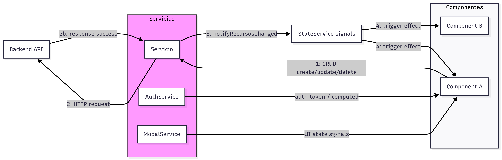

# Fase 6: Gestión de estado y actualización dinámica

## Patrón de gestión de estado

Se ha establecido **Angular Signals** como patrón claro y principal para la gestión de estado. `BehaviorSubject` (RxJS) se permite únicamente en casos puntuales donde sea necesaria interoperabilidad con pipelines RxJS o código legado. A continuación se recogen reglas de uso, ejemplos de implementación y una justificación desarrollada.

### Implementación y ejemplos

- `StateService` centraliza notificaciones mediante triggers (`signal(0)`) que se incrementan tras operaciones CRUD. ([state.service.ts](../../src/app/services/state.service.ts))

Ejemplo: `StateService`

```typescript
@Injectable({ providedIn: 'root' })
export class StateService {
	private _recursosTrigger = signal(0);
	readonly recursosTrigger = this._recursosTrigger.asReadonly();

	notifyRecursosChanged(): void {
		this._recursosTrigger.update(v => v + 1);
	}
}
```

Ejemplo: `RecursoService` (notificar tras CRUD)

```typescript
create(payload: RecursoRequest) {
	return this.api.post<RecursoResponse>(this.base, payload).pipe(
		tap(() => this.state.notifyRecursosChanged()),
		catchError(err => this.handleError(err))
	);
}

update(id: number, payload: RecursoUpdate) {
	return this.api.put(`${this.base}/${id}`, payload).pipe(
		tap(() => this.state.notifyRecursosChanged()),
		catchError(err => this.handleError(err))
	);
}
```

Ejemplo: componente que reacciona con `effect()`

```typescript
constructor() {
	effect(() => {
		const t = this.stateService.recursosTrigger();
		if (t > 0 && this.grupoId) this.loadRecursos();
	});
}
```

Ejemplo: `AuthService` con `signal` y `computed`

```typescript
private tokenSignal = signal<string | null>(localStorage.getItem(KEY) ?? null);
usuarioDetalles = signal<UsuarioResponse | null>(null);
usuarioActual = computed(() => {
	const token = this.tokenSignal();
	if (!token) return null;
	const decoded = jwtDecode(token) as DecodedToken;
	return { ...decoded, id: this.usuarioDetalles()?.id ?? null };
});
```

Ejemplo: `ModalService` (UI state)

```typescript
abierto = signal(false);
mostrar() { this.abierto.set(true); }
cerrar() { this.abierto.set(false); }
```

Ejemplo: `ThemeSwitcherService` con `BehaviorSubject` (interoperabilidad)

```typescript
private isDarkSubject = new BehaviorSubject<boolean>(false);
isDark$ = this.isDarkSubject.asObservable();
alternarTema() { this.isDarkSubject.next(!this.isDarkSubject.value); }
```

### Justificación desarrollada

Por qué se eligió Signals como patrón principal:

- Simplicidad y legibilidad: menos conceptos y boilerplate que NgRx.
- Rendimiento: reactividad granular que se integra bien con `OnPush`.
- Mantenibilidad: menos dependencias externas y menor superficie de mantenimiento.
- Acceso sincrónico: `signal()`/`computed()` permite lecturas síncronas desde guards/resolvers.

Por qué se usó `BehaviorSubject` en casos puntuales:

- Compatibilidad con pipelines RxJS existentes (operators, shareReplay, debounceTime).
- Integración con APIs o librerías que esperan `Observable`.

Limitaciones y mitigaciones:

- Tracing y depuración: Signals no ofrece por defecto time-travel; si se requiere, evaluar NgRx SignalStore o añadir logging estructurado.
- Triggers como contadores: no llevan payload; si la aplicación necesita transportar datos o historial, introducir stores específicas (SignalStore / NgRx) para esa entidad.
- Riesgo de inconsistencias si servicios no notifican: mitigar con pruebas unitarias que verifiquen llamadas a `notify*` tras operaciones CRUD.

Cuándo migrar a NgRx/SignalStore:

- Aumenta la complejidad de flujos (cross-cutting effects, undo/redo, time-travel).  
- Necesidad de DevTools y trazabilidad avanzada.  


### Ventajas

- Reacción automática y determinista en componentes cuando cambia el estado.
- Menor boilerplate que soluciones basadas en reducers/actions.
- Mejor rendimiento y granularidad con Signals frente a detección basada en zonas.
- Menor coste de mantenimiento al evitar dependencias externas.

### Limitaciones

- Los triggers actuales son contadores simples: no transportan payloads ni históricos.
- Requiere que cada servicio de datos invoque explícitamente la notificación tras operaciones.
- La trazabilidad y debugging avanzado (time-travel, DevTools) no están disponibles por defecto.

### Adecuación al proyecto

Para este proyecto, Signals proporciona un equilibrio adecuado entre simplicidad y rendimiento: reduce boilerplate y facilita la creación de componentes reactivos compatibles con la estrategia `OnPush`. Mantener `BehaviorSubject` en puntos concretos (por ejemplo, para integración con operadores RxJS o librerías que esperan `Observable`) permite interoperabilidad sin romper la coherencia del patrón.

### Estrategias de optimización

- Usar `ChangeDetectionStrategy.OnPush` en componentes y señales (`signal`/`computed`) para re-renderizar solo lo necesario.
- Preferir `computed()` para cálculos derivados y evitar recomputaciones innecesarias.
- Limitar el alcance de los `effect()` con condiciones y dependencias claras; evitar efectos que ejecuten recargas completas sin necesidad.
- Evitar transportar grandes payloads en los triggers; usar triggers como señales para provocar recarga selectiva desde el servicio de datos.
- Cachear respuestas frecuentes en `ApiService` (memory cache / TTL) o usar estrategias de revalidación para reducir peticiones.
- En for/listas, usar `trackBy` para minimizar DOM updates y paginación para conjuntos grandes.
- Para búsquedas/filtrado, usar `BehaviorSubject` + `debounceTime` + `switchMap` antes de escribir en el store.

### Comparativa de patrones

- Servicios con `BehaviorSubject`:
	- Complejidad: baja. Bueno para flujos basados en RxJS.
	- Pros: interoperabilidad RxJS, operadores potentes.
	- Contras: riesgo de fugas si no se gestiona `unsubscribe`, menos granularidad en detección de cambios.

- Angular Signals:
	- Complejidad: baja-media.
	- Pros: reactividad granular, integración con `OnPush`, lecturas síncronas y menor boilerplate.
	- Contras: menos DevTools nativas y triggers simples no transportan payloads.

- NgRx (o SignalStore/Redux-like):
	- Complejidad: alta.
	- Pros: trazabilidad, DevTools, pattern robusto para apps enterprise.
	- Contras: mucho boilerplate, curva de aprendizaje, posible sobredimensionamiento para apps medianas.

### Diagrama flujo de datos y roles



Notas:

- (1) El componente inicia la operación a través del servicio.
- (2) El servicio realiza la petición HTTP al backend y procesa la respuesta.
- (3) Tras éxito, el servicio llama a `notify*` en `StateService`.
- (4) `StateService` actualiza los `signal`-triggers; componentes con `effect()` reaccionan y recargan selectivamente.

## Paginación y Scroll Infinito

Para listas grandes (recursos, reservas) se implementó soporte dual: paginación clásica y scroll infinito.

- Backend: los endpoints relevantes devuelven `Page<T>` (Spring Page). Esto permite solicitar páginas concretas con `page` y `size` y evita traer todo en memoria.
- Frontend: el `GrupoService.getRecursos(page, size, filtros)` mapea la respuesta `Page` a `ApiListResponse<T>` con `{ items, total }`.
- Componente `app-paginador`: navegación numerada, accesible y con rango inteligente (`1 ... 4 [5] 6 ... 20`). Inputs: `totalElementos`, `tamanoPagina`, `paginaActual`. Output: `cambioPagina`.
- Directiva `appScrollInfinito`: usa `IntersectionObserver` para emitir `alHacerScroll` cuando el trigger invisible entra en viewport; desconecta en `ngOnDestroy`.
- Página `Recursos`: soporta estrategias mediante `estrategiaPaginacion` (`'scroll-infinito'` por defecto). Estado con Signals: `recursos`, `paginaActual`, `totalRecursos`, `cargandoMas`.

Patrón de uso:

- Scroll infinito: carga la página 0 y al detectar el trigger incrementa `paginaActual` y *acumula* (`append`) los `items` recibidos.
- Paginador clásico: solicita página N y *reemplaza* los `items` (no acumula).

Beneficios:

- Menor uso de memoria en backend y mayor control de tráfico (paginación).
- UX suave con scroll infinito para usuarios (carga incremental) y alternativa clásica cuando se necesita control exacto.


