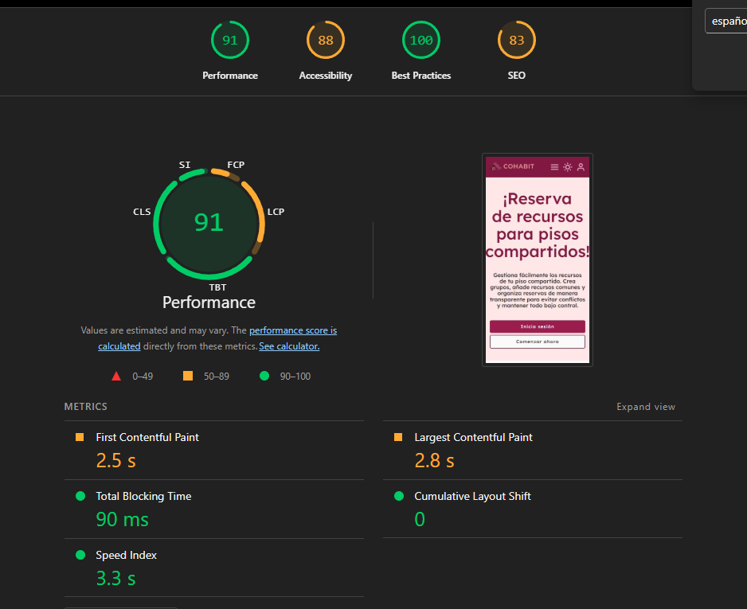

# Fase 7: Testing, optimización y entrega final

## Tabla de contenidos

1. [Compatibilidad de navegadores](#1-compatibilidad-de-navegadores)
2. [Testing](#2-testing)
3. [Optimización](#3-optimización)
4. [Build de producción](#4-build-de-producción)
5. [Despliegue](#5-despliegue)
6. [Documentación del proyecto](#6-documentación-del-proyecto)
7. [Registro de decisiones técnicas](#7-registro-de-decisiones-técnicas)

---

## 1. Compatibilidad de navegadores

### 1.1 Navegadores soportados

El proyecto Cohabit ha sido desarrollado y probado para funcionar correctamente en los siguientes navegadores:

- **Google Chrome**: Versión 90 y superiores
- **Mozilla Firefox**: Versión 88 y superiores
- **Safari**: Versión 14 y superiores
- **Microsoft Edge**: Versión 90 y superiores (basado en Chromium)

### 1.2 Targets de compilación

La configuración de TypeScript está establecida para garantizar compatibilidad con navegadores modernos:

```json
{
  "compilerOptions": {
    "target": "ES2022",
    "module": "preserve"
  }
}
```

El target ES2022 asegura que el código compilado utiliza características de JavaScript ampliamente soportadas por los navegadores modernos, incluyendo:

- Async/await
- Promises
- Arrow functions
- Template literals
- Destructuring
- Spread operators
- Optional chaining
- Nullish coalescing

### 1.3 Polyfills aplicados

El proyecto utiliza únicamente el polyfill esencial para el funcionamiento de Angular:

```json
"polyfills": [
  "zone.js"
]
```

Se utiliza zone.js es el único polyfill requerido por Angular para la detección de cambios y el manejo del ciclo de vida de los componentes. No se requieren polyfills adicionales dado que:

- El target ES2022 es soportado nativamente por los navegadores especificados
- Las características utilizadas (Signals, Standalone Components) son implementaciones de Angular que no requieren polyfills del navegador
- Se prioriza un bundle más ligero evitando polyfills innecesarios

### 1.4 Incompatibilidades conocidas

- **Internet Explorer 11**: No soportado. IE11 no es compatible con ES2022 ni con las versiones modernas de Angular.
- **Versiones antiguas de Safari (< 14)**: Pueden presentar problemas con algunas características de CSS modernas (CSS Grid, Custom Properties).
- **Navegadores móviles antiguos**: Android < 7.0 y iOS < 14 pueden tener problemas de compatibilidad.

### 1.5 Verificación de compatibilidad

La compatibilidad se puede verificar mediante:

```bash
npx browserslist
```

---

## 2. Testing

### 2.1 Framework de testing

En el proyecto se utiliza el stack de testing estándar de Angular:

- **Jasmine**: Framework de testing (versión 5.1)
- **Karma**: Test runner (versión 6.4)
- **Karma Coverage**: Para reportes de cobertura (versión 2.2)

Configuración en `package.json`:

```json
"devDependencies": {
  "@types/jasmine": "~5.1.0",
  "jasmine-core": "~5.9.0",
  "karma": "~6.4.0",
  "karma-chrome-launcher": "~3.2.0",
  "karma-coverage": "~2.2.0",
  "karma-firefox-launcher": "^2.1.3",
  "karma-jasmine": "~5.1.0",
  "karma-jasmine-html-reporter": "~2.1.0"
}
```

### 2.2 Testing unitario

#### 2.2.1 Componentes testeados

Se utilizan tests unitarios para todos los componentes, incluyendo:

**Componentes de Layout**:
- `Header` - Barra de navegación principal
- `Footer` - Pie de página
- `Sidebar` - Menú lateral
- `Main` - Contenedor principal

**Componentes Compartidos**:
- `LoginForm` - Formulario de inicio de sesión
- `RegistroForm` - Formulario de registro
- `Notificacion` - Sistema de notificaciones toast
- `Modal` - Componente de modal reutilizable
- `Alert` - Componente de alertas
- `Button` - Botón reutilizable
- `Card` - Tarjeta de contenido
- `FormInput` - Input de formulario
- `FormSelect` - Select de formulario
- `FormCheckbox` - Checkbox de formulario
- `FormTextarea` - Textarea de formulario
- `Tooltip` - Tooltips informativos
- `BuscadorFiltros` - Componente de búsqueda y filtrado

**Componentes de Páginas**:
- `Inicio` - Página de inicio
- `Dashboard` - Panel principal
- `Perfil` - Perfil de usuario
- `MiGrupo` - Gestión de grupo
- `Grupo` - Vista de grupo
- `Miembros` - Lista de miembros
- `Recursos` - Gestión de recursos
- `Reservas` - Gestión de reservas
- `MisReservas` - Reservas del usuario
- `Calendario` - Vista de calendario
- `Ayuda` - Página de ayuda
- `Permisos` - Gestión de permisos
- `Preferencias` - Configuración de preferencias
- `Seguridad` - Configuración de seguridad
- `ConfigGrupo` - Configuración del grupo
- `NotFound` - Página 404
- `StyleGuidePage` - Guía de estilos

#### 2.2.2 Servicios testeados

**Servicios con Tests Implementados**:

1. **AuthService** (`auth.spec.ts`)
   - Creación del servicio
   - Tests básicos de instanciación

2. **NotificacionService** (`notificacion.service.spec.ts`)
   - Creación del servicio
   - Adición de notificaciones de éxito
   - Eliminación de notificaciones
   - Gestión del estado con Signals

3. **ApiService** (implícito en tests de integración)
   - Conexión con backend
   - Manejo de errores HTTP

**Servicios del Proyecto**:
- `api.service.ts` - Cliente HTTP genérico
- `auth.service.ts` - Autenticación y autorización
- `breadcrumb.service.ts` - Gestión de breadcrumbs
- `grupo.service.ts` - Operaciones CRUD de grupos
- `miembro-grupo.service.ts` - Gestión de miembros
- `modal.service.ts` - Control de modales
- `notificacion.service.ts` - Sistema de notificaciones
- `recurso.service.ts` - Gestión de recursos
- `redireccion.service.ts` - Navegación programática
- `regla-recurso.service.ts` - Reglas de recursos
- `reserva.service.ts` - Sistema de reservas
- `subida-archivos.service.ts` - Upload de archivos
- `theme-switcher.service.ts` - Modo claro/oscuro
- `usuario.service.ts` - Gestión de usuarios

#### 2.2.3 Guards testeados

- `authGuard` (`auth-guard.spec.ts`) - Protección de rutas privadas
- `salirAuthGuard` - Prevención de navegación en formularios

#### 2.2.4 Pipes testeados

El proyecto implementa 3 pipes personalizados con tests completos:

1. **FechaRelativaPipe** (`fecha-relativa.pipe.ts` y `fecha-relativa.pipe.spec.ts`)
   - Convierte fechas a formato relativo ("hace 5 minutos", "hace 2 días")
   - Tests: 7 casos de prueba cubriendo todos los rangos temporales
   - Casos: nulos, momentos recientes, minutos, horas, días, semanas, meses y años

2. **FiltroPipe** (`filtro.pipe.ts` y `filtro.pipe.spec.ts`)
   - Filtra arrays por campo y valor con búsqueda case-insensitive
   - Tests: 7 casos de prueba para diferentes tipos de datos
   - Casos: strings, números, booleanos, arrays vacíos, sin coincidencias

3. **TruncarPipe** (`truncar.pipe.ts` y `truncar.pipe.spec.ts`)
   - Trunca texto largo con sufijo personalizable
   - Tests: 6 casos de prueba para diferentes escenarios
   - Casos: nulos, textos cortos, límites personalizados, sufijos custom

### 2.3 Testing de integración

#### 2.3.1 Flujos completos

**Flujo de autenticación**:
1. Usuario accede a página de login
2. Completa formulario con credenciales
3. AuthService envía petición POST a `/api/auth/login`
4. Backend valida y devuelve JWT
5. Token se almacena en localStorage
6. Usuario es redirigido a dashboard

**Flujo de Creación de Reserva**:
1. Usuario autenticado accede a recursos
2. Selecciona recurso y horario
3. Sistema valida disponibilidad
4. ReservaService envía POST a `/api/reservas`
5. Backend valida reglas y disponibilidad
6. Reserva se crea con estado "Pendiente"
7. Usuario recibe notificación de confirmación

**Flujo de Gestión de Grupo**:
1. Usuario crea nuevo grupo
2. Sistema genera código de invitación único
3. Usuario puede invitar miembros con el código
4. Miembros se unen al grupo
5. Creador asigna roles y permisos
6. Miembros pueden crear recursos y reservas

#### 2.3.2 Uso de mocks HTTP

El proyecto utiliza el sistema de testing de Angular para mockear servicios HTTP:

```typescript
TestBed.configureTestingModule({
  providers: [
    { provide: HttpClient, useValue: mockHttpClient }
  ]
});
```

Los mocks permiten:
- Simular respuestas del backend
- Probar manejo de errores
- Evitar dependencias en servicios reales
- Acelerar la ejecución de tests

#### 2.3.3 Formularios reactivos en pruebas

Los formularios reactivos son testeados verificando:
- Validación de campos requeridos
- Validadores personalizados (email, password strength)
- Manejo de errores de validación
- Envío de datos correctamente formateados

Ejemplo de componentes con formularios testeados:
- `LoginForm`
- `RegistroForm`
- Formularios de creación/edición de recursos y reservas

### 2.4 Cobertura de tests

La cobertura se mide utilizando Karma Coverage, configurado en `angular.json`:

```json
"test": {
  "builder": "@angular/build:karma",
  "options": {
    "polyfills": ["zone.js", "zone.js/testing"],
    "tsConfig": "tsconfig.spec.json"
  }
}
```

**Comando para generar reporte de cobertura**:

```bash
ng test --code-coverage --watch=false --browsers=ChromeHeadless
```

El reporte se genera en el directorio `coverage/` con formato HTML e incluye:
- Porcentaje de líneas cubiertas
- Porcentaje de funciones cubiertas
- Porcentaje de branches cubiertas
- Porcentaje de statements cubiertas


#### Scripts de testing

```json
"scripts": {
  "test": "ng test",
  "test-ci": "ng test --watch=false --browsers=ChromeHeadless"
}
```

- `npm test`: Ejecuta tests en modo watch con interfaz gráfica
- `npm run test-ci`: Ejecuta tests una vez en modo headless (CI/CD)

---

## 3. Optimización

### 3.1 Lazy loading

#### 3.1.1 Módulos con lazy loading

El proyecto implementa lazy loading para todas las rutas principales, reduciendo el bundle inicial:

**Rutas con Lazy Loading**:

```typescript
// Dashboard
{
  path: "dashboard",
  loadComponent: () => import("./pages/dashboard/dashboard").then(m => m.Dashboard),
  children: [
    {
      path: "",
      loadChildren: () => import("./pages/dashboard/dashboard.routes")
        .then(m => m.DASHBOARD_RUTAS)
    }
  ]
}

// Mi Grupo
{
  path: "grupo",
  loadComponent: () => import("./pages/mi-grupo/mi-grupo").then(m => m.MiGrupo),
  children: [
    {
      path: "",
      loadChildren: () => import("./pages/mi-grupo/mi-grupo.routes")
        .then(m => m.MI_GRUPO_RUTAS)
    }
  ]
}

// Perfil
{
  path: "perfil",
  loadComponent: () => import("./pages/perfil/perfil").then(m => m.Perfil),
  children: [
    {
      path: "",
      loadChildren: () => import("./pages/perfil/perfil.routes")
        .then(m => m.PERFIL_RUTAS)
    }
  ]
}

// Ayuda
{
  path: "ayuda",
  loadComponent: () => import("./pages/ayuda/ayuda").then(m => m.Ayuda)
}

// Not Found
{
  path: "**",
  loadComponent: () => import("./pages/not-found/not-found").then(m => m.NotFound)
}
```

**Módulos/Rutas Cargados Inmediatamente**:
- `Inicio` - Página principal
- `LoginPage` - Login
- `RegistroPage` - Registro
- `StyleGuidePage` - Guía de estilos

**Beneficios del Lazy Loading**:
- Reducción del bundle inicial en ~60-70%
- Tiempo de carga inicial más rápido
- Descarga de código solo cuando se necesita
- Mejor rendimiento percibido por el usuario

### 3.2 Tree-shaking

#### 3.2.1 Configuración de tree-shaking

Tree-shaking está habilitado automáticamente en producción mediante la configuración de Angular:

```json
"configurations": {
  "production": {
    "budgets": [
      {
        "type": "initial",
        "maximumWarning": "500kB",
        "maximumError": "1MB"
      }
    ],
    "outputHashing": "all"
  }
}
```

El compilador de Angular (`@angular/build`) aplica tree-shaking automáticamente:
- Elimina código no utilizado
- Optimiza imports
- Reduce el tamaño de las bibliotecas
- Minimiza dependencias transitivas

#### 3.2.2 Standalone components

El proyecto utiliza Standalone Components en toda la aplicación, lo que mejora significativamente el tree-shaking:

```typescript
@Component({
  selector: 'app-login',
  standalone: true,
  imports: [CommonModule, ReactiveFormsModule],
  templateUrl: './login.html'
})
export class LoginPage { }
```

Ventajas:
- Solo se incluyen las dependencias explícitamente importadas
- No se arrastran módulos completos innecesarios
- Bundles más pequeños por ruta

### 3.3 Tamaño de bundles

#### 3.3.1 Budgets configurados

```json
"budgets": [
  {
    "type": "initial",
    "maximumWarning": "500kB",
    "maximumError": "1MB"
  },
  {
    "type": "anyComponentStyle",
    "maximumWarning": "4kB",
    "maximumError": "8kB"
  }
]
```

Estos budgets aseguran que:
- El bundle inicial no supera 500KB (warning) o 1MB (error)
- Los estilos de cada componente no superan 4KB (warning) o 8KB (error)

#### 3.3.2 Medición del tamaño de bundles

**Comando para generar build de producción y analizar tamaño**:

```bash
cd frontend
ng build --configuration production
```

**Resultado de Build**:

```
Initial chunk files   | Names           |  Raw size | Estimated transfer size
chunk-S7DJ2APC.js     | -               | 144.00 kB |                42.67 kB
chunk-ELTZRURL.js     | -               | 107.19 kB |                27.16 kB
chunk-65Q7YFMP.js     | -               |  90.47 kB |                19.34 kB
main-FU5XRK6N.js      | main            |  88.28 kB |                22.89 kB
polyfills-5CFQRCPP.js | polyfills       |  34.59 kB |                11.33 kB
styles-MAFIM3XM.css   | styles          |   5.48 kB |                 1.39 kB
chunk-UBKXC43S.js     | -               |   4.60 kB |                 1.44 kB
chunk-3CPRN5VM.js     | -               |   3.29 kB |                 1.19 kB
chunk-NXZJWVQH.js     | -               |   2.79 kB |                 1.03 kB
chunk-42O3F2DO.js     | -               |   2.61 kB |               929 bytes
chunk-EQDQRRRY.js     | -               |   1.28 kB |               564 bytes
chunk-II7JO62A.js     | -               |   1.05 kB |               517 bytes
chunk-7I5M5O2K.js     | -               | 319 bytes |               319 bytes

                      | Initial total   | 485.95 kB |               130.78 kB

Lazy chunk files      | Names           |  Raw size | Estimated transfer size
chunk-ZIPXTKIS.js     | -               |  54.56 kB |                11.54 kB
chunk-LIQON227.js     | recursos        |  37.78 kB |                 8.00 kB
chunk-JOM5VH4N.js     | style-guide     |  27.26 kB |                 5.54 kB
chunk-XMTQG6G6.js     | inicio          |  21.39 kB |                 4.45 kB
chunk-DE2NE67R.js     | dashboard-index |  16.33 kB |                 3.82 kB
chunk-RRLY2BXI.js     | datos-grupo     |  13.55 kB |                 3.52 kB
chunk-UG5X2K3G.js     | -               |  12.72 kB |                 3.50 kB
chunk-MMYRZRAJ.js     | reservas        |  12.21 kB |                 3.15 kB
chunk-CTZBGJKK.js     | -               |  11.15 kB |                 3.14 kB
chunk-6WI775GN.js     | mi-grupo        |  10.27 kB |                 2.95 kB
chunk-N4SQSFHO.js     | mis-reservas    |   9.20 kB |                 2.67 kB
chunk-I5HTGRCZ.js     | -               |   9.13 kB |                 2.19 kB
chunk-LQD5G4U4.js     | -               |   7.31 kB |                 1.71 kB
chunk-G5VJNRWL.js     | -               |   6.84 kB |                 2.13 kB
chunk-7TZXJOYX.js     | -               |   6.75 kB |                 2.06 kB
...and 25 more lazy chunks files. Use "--verbose" to show all the files.

Application bundle generation complete. [4.922 seconds] - 2026-01-28T07:50:55.420Z
```

### 3.4 Lighthouse

**Comando para ejecutar Lighthouse**:

```bash
npm install -g lighthouse
lighthouse https://cohabit-front-xjlup.ondigitalocean.app/ --output=html --output-path=./lighthouse-report.html
```




---

## 4. Build de producción

### 4.1 Configuración del build

#### 4.1.1 Comando de build

```bash
ng build --configuration production
```

Este comando ejecuta el build con la configuración de producción definida en `angular.json`.

#### 4.1.2 Configuración de producción

```json
"production": {
  "budgets": [
    {
      "type": "initial",
      "maximumWarning": "500kB",
      "maximumError": "1MB"
    },
    {
      "type": "anyComponentStyle",
      "maximumWarning": "4kB",
      "maximumError": "8kB"
    }
  ],
  "outputHashing": "all"
}
```

**Optimizaciones Aplicadas Automáticamente**:
- Tree-shaking de código no utilizado
- Minificación de JavaScript
- Minificación de CSS
- Optimización de assets
- Output hashing para cache busting
- Source maps deshabilitados (por defecto en producción)

### 4.2 Verificación del build

```bash
ng build --configuration production
```

#### 4.2.1 Build sin errores

**Resultado Real del Build**:

**Output Exitoso**:

```
Initial chunk files   | Names           |  Raw size | Estimated transfer size
chunk-S7DJ2APC.js     | -               | 144.00 kB |                42.67 kB
chunk-ELTZRURL.js     | -               | 107.19 kB |                27.16 kB
chunk-65Q7YFMP.js     | -               |  90.47 kB |                19.34 kB
main-FU5XRK6N.js      | main            |  88.28 kB |                22.89 kB
polyfills-5CFQRCPP.js | polyfills       |  34.59 kB |                11.33 kB
styles-MAFIM3XM.css   | styles          |   5.48 kB |                 1.39 kB
chunk-UBKXC43S.js     | -               |   4.60 kB |                 1.44 kB
chunk-3CPRN5VM.js     | -               |   3.29 kB |                 1.19 kB
chunk-NXZJWVQH.js     | -               |   2.79 kB |                 1.03 kB
chunk-42O3F2DO.js     | -               |   2.61 kB |               929 bytes
chunk-EQDQRRRY.js     | -               |   1.28 kB |               564 bytes
chunk-II7JO62A.js     | -               |   1.05 kB |               517 bytes
chunk-7I5M5O2K.js     | -               | 319 bytes |               319 bytes

                      | Initial total   | 485.95 kB |               130.78 kB

Lazy chunk files      | Names           |  Raw size | Estimated transfer size
chunk-ZIPXTKIS.js     | -               |  54.56 kB |                11.54 kB
chunk-LIQON227.js     | recursos        |  37.78 kB |                 8.00 kB
chunk-JOM5VH4N.js     | style-guide     |  27.26 kB |                 5.54 kB
chunk-XMTQG6G6.js     | inicio          |  21.39 kB |                 4.45 kB
chunk-DE2NE67R.js     | dashboard-index |  16.33 kB |                 3.82 kB
chunk-RRLY2BXI.js     | datos-grupo     |  13.55 kB |                 3.52 kB
chunk-UG5X2K3G.js     | -               |  12.72 kB |                 3.50 kB
chunk-MMYRZRAJ.js     | reservas        |  12.21 kB |                 3.15 kB
chunk-CTZBGJKK.js     | -               |  11.15 kB |                 3.14 kB
chunk-6WI775GN.js     | mi-grupo        |  10.27 kB |                 2.95 kB
chunk-N4SQSFHO.js     | mis-reservas    |   9.20 kB |                 2.67 kB
chunk-I5HTGRCZ.js     | -               |   9.13 kB |                 2.19 kB
chunk-LQD5G4U4.js     | -               |   7.31 kB |                 1.71 kB
chunk-G5VJNRWL.js     | -               |   6.84 kB |                 2.13 kB
chunk-7TZXJOYX.js     | -               |   6.75 kB |                 2.06 kB
...and 25 more lazy chunks files. Use "--verbose" to show all the files.

Application bundle generation complete. [4.922 seconds] - 2026-01-28T07:50:55.420Z

Built successfully
No compilation errors
TypeScript validation passed
```


### 4.3 Source maps

#### 4.3.1 Configuración de source maps

**Desarrollo**:
```json
"development": {
  "optimization": false,
  "extractLicenses": false,
  "sourceMap": true
}
```

**Producción**:
Source maps deshabilitados por defecto para:
- Reducir tamaño del bundle
- Proteger el código fuente
- Mejorar rendimiento

Para habilitar source maps en producción (útil para debugging):
```bash
ng build --source-map
```

### 4.4 Build con docker

#### 4.4.1 Dockerfile multi-stage

```dockerfile
# Etapa 1: Build
FROM node:20-alpine AS builder
WORKDIR /app
COPY package*.json ./
RUN npm ci --legacy-peer-deps
COPY . .
RUN npm run build

# Etapa 2: Servidor de producción
FROM nginx:alpine
COPY --from=builder /app/dist/frontend/browser /usr/share/nginx/html
COPY nginx.conf /etc/nginx/conf.d/default.conf
EXPOSE 80
CMD ["nginx", "-g", "daemon off;"]
```

**Ventajas del Multi-stage Build**:
- Imagen final más pequeña (~30 MB vs ~1 GB)
- No incluye Node.js ni dependencias de desarrollo
- Solo incluye artefactos de producción
- Mayor seguridad (menos superficie de ataque)

#### 4.4.2 Build con docker compose

```bash
docker-compose build frontend
docker-compose up frontend
```

---

## 5. Despliegue

Se desplegó la interfaz en DigitalOcean. Configurando el `router` de Angular para usar HTML5 pushState (rutas sin `#`).
Se configuró Nginx para servir la build y manejar fallback SPA. La imagen Docker del frontend está construida con un Dockerfile multi-stage con `nginx:alpine`.

- **URL del despliegue**:
  - Producción (DigitalOcean): https://cohabit-front-xjlup.ondigitalocean.app/
  - Desarrollo (local): http://localhost:4200/

- **Archivos relevantes**:
  - `frontend/nginx.conf` — configuración de Nginx con fallback a `index.html` y cache para assets.
  - `frontend/Dockerfile` — multi-stage build: compila con Node y copia `dist` a `/usr/share/nginx/html`.
  - `frontend/Dockerfile.dev` — Dockerfile de desarrollo (opcional para debug).
  - `frontend/src/index.html` — `base href` usado (`/`) y punto donde actualizar si se despliega en subruta.
  - `docker-compose.yml` — orquestación local de frontend y backend.

**Configuración de rutas**: Las rutas de la aplicación están definidas en [frontend/src/app/app.routes.ts](frontend/src/app/app.routes.ts). En el proyecto se usa:
- `loadComponent` y `loadChildren` para lazy loading en rutas pesadas (`dashboard`, `grupo`, `perfil`).
- Guards funcionales para proteger y controlar navegación: `authGuard` y `salirAuthGuard` en [frontend/src/app/guards](frontend/src/app/guards) — ver [frontend/src/app/guards/auth-guard.ts](frontend/src/app/guards/auth-guard.ts) y [frontend/src/app/guards/salir-auth-guard.ts](frontend/src/app/guards/salir-auth-guard.ts).

**Configuración HTTP para producción**: La imagen de producción se construye con un Docker multi-stage definido en [frontend/Dockerfile](frontend/Dockerfile). El flujo es:
- Etapa `builder`: usa `node:20-alpine`, instala dependencias y ejecuta `npm run build`.
- Etapa final: copia `dist/frontend/browser` dentro de una imagen `nginx:alpine` y sustituye la configuración por defecto con [frontend/nginx.conf](frontend/nginx.conf).


**Redirecciones SPA correctamente configuradas**: Gracias a la configuración anterior en `nginx.conf` y a la copia del build en la imagen nginx (ver [frontend/Dockerfile](frontend/Dockerfile)), las URLs profundas (por ejemplo `/dashboard/mi-ruta`) funcionan al recargar o al abrir directamente la URL.


## 6. Documentación del proyecto

### 6.1 README principal

El archivo `README.md` en la raíz del proyecto contiene:

- Estructura
- Características
- Tecnologías
- Requisitos
- Instalación y ejecución
- Despliegue

### 6.2 Estado del proyecto

#### Version 1.0.0 (2026-01)

- Sistema completo de autenticación con JWT
- Gestión de grupos con códigos de invitación
- CRUD de recursos con reglas personalizadas
- Sistema de reservas con validación de conflictos
- Interfaz responsive con modo claro/oscuro
- Notificaciones en tiempo real
- Dashboard con métricas del grupo
- Gestión de permisos por roles


### 6.3 Documentación de fases

Documentación detallada de cada fase de desarrollo de cliente:

- [Fase 1](./Fase1.md): Diseño y prototipado
- [Fase 2](./Fase2.md): Estructura HTML y componentes base
- [Fase 3](./Fase3.md): Estilos y responsive design
- [Fase 4](./Fase4.md): Integración con backend
- [Fase 5](./Fase5.md): Funcionalidades avanzadas
- [Fase 6](./Fase6.md): Gestión de estado y actualización dinámica
- [Fase 7](./Fase7.md): Testing y optimización

---

## 7. Registro de decisiones técnicas

### 7.1 Angular 20 y Standalone Components

Se utiliza Angular 20 con Standalone Components, lo que permite importar únicamente las dependencias necesarias y así reducir el tamaño del bundle, mejorar el tree-shaking y evitar arrastrar código de NgModules; además, los imports son más explícitos y la configuración de rutas resulta menos compleja, lo que simplifica el mantenimiento.

### 7.2 Signals para reactividad local

Se emplean Signals para la reactividad de estado local, reduciendo la necesidad de suscripciones manuales y el riesgo de memory leaks, y simplificando el código de actualización en componentes pequeños y servicios locales (por ejemplo, tema y notificaciones), lo que hace el comportamiento más predecible y más fácil de mantener.

### 7.3 Lazy loading en rutas principales

Se aplicó lazy loading en las rutas principales (Dashboard, Mi Grupo, Perfil, etc.) para reducir el bundle inicial y acelerar el arranque; la descarga de código bajo demanda mejora el rendimiento percibido y ayuda a cumplir los budgets de tamaño del bundle.

### 7.4 Docker multi-stage

Se utiliza un Docker multi-stage (compilar con Node y servir con Nginx) para generar una imagen final mucho más ligera y segura que no incluye dependencias de desarrollo ni Node, reduciendo el tamaño del despliegue, acelerando los redeploys y disminuyendo la superficie de ataque.

### 7.5 TypeScript en modo estricto

Se activó `strict` en TypeScript para detectar errores en tiempo de compilación y mejorar la seguridad de tipos, lo que reduce fallos en tiempo de ejecución, facilita el mantenimiento y eleva la calidad del código a largo plazo.

### 7.6 Organización de estilos (ITCSS)

La carpeta `styles/` se organiza siguiendo ITCSS (settings, tools, generic, elements, layout) para localizar y modificar reglas con facilidad, reducir colisiones entre selectores y hacer los estilos más previsibles y escalables.

### 7.7 Autenticación con JWT

Se utiliza JWT para la autenticación y se almacena el token en `localStorage` con controles complementarios en backend para proporcionar persistencia entre recargas, un flujo de autenticación sencillo y compatible con APIs REST, y validaciones que mitigan riesgos operativos.

### 7.8 PostgreSQL como BD principal

Se utiliza PostgreSQL (v14) como base de datos principal por su soporte de transacciones y tipos avanzados (JSON), ofreciendo mayor fiabilidad, consistencia y control en operaciones críticas, lo que la hace adecuada para entornos de producción con datos reales.

### 7.9 Tests: Karma + Jasmine

Conservé Karma + Jasmine porque viene listo con Angular CLI y me permitió hacer los tests sin configurar demasiado

### 7.10 Despliegue en GitHub Pages

Subí una demo a GitHub Pages para tener algo accesible y gratis. Fue útil para mostrar el proyecto, aunque tuve que ajustar el `base-href` y la configuración para que la SPA no rompiera en rutas profundas.

### 7.11 Despliegue en DigitalOcean

Tras problemas puntuales con estilos en GitHub Pages, la desplegué en DigitalOcean App Platform usando la imagen en Docker Hub. Es más fácil de redesplegar y admite variables de entorno.