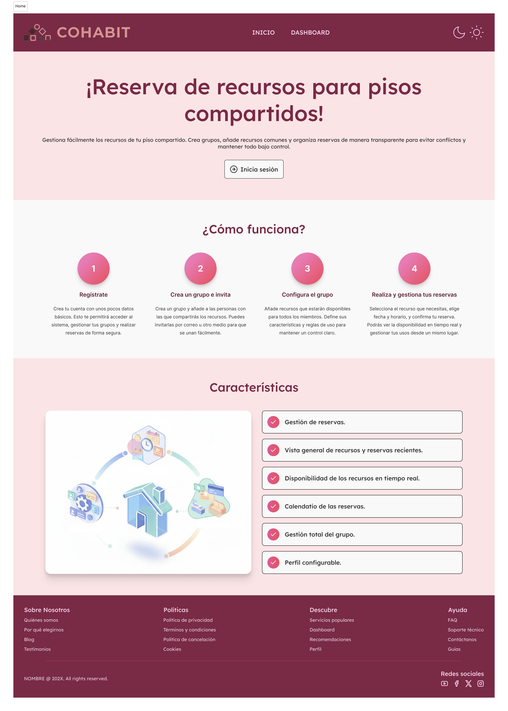
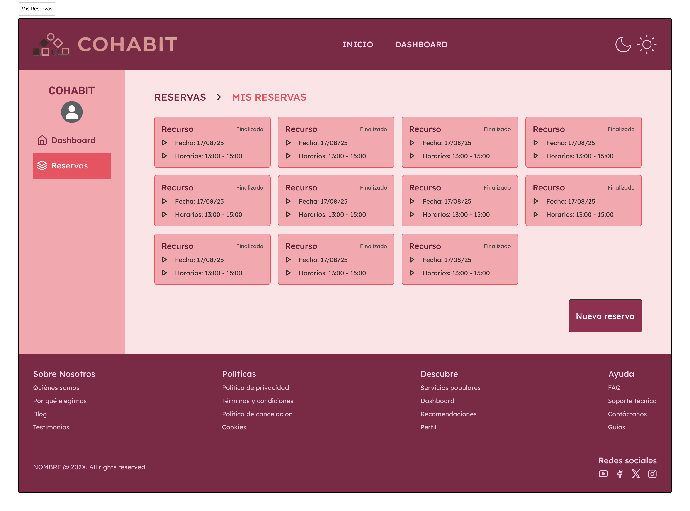
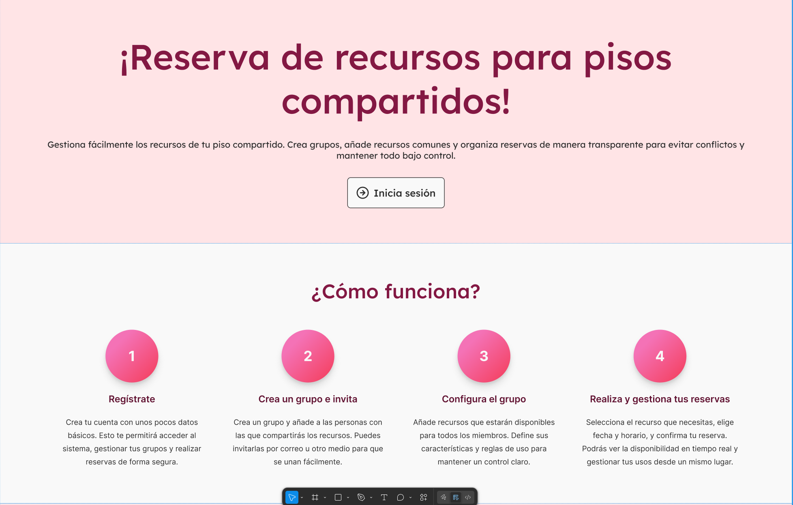

# Documentación Diseño

## Sección 1: Arquitectura CSS y comunicación visual

### 1.1 Principios de comunicación visual

- **Jerarquía**: permite guiar la atención del espectador a través del contenido en un orden determinado, desde lo más importante hasta lo menos relevante. Una buena jerarquía asegura que el mensaje principal se vea claramente.

- **Contraste**: sirve para llamar la atención sobre elementos específicos y resaltar diferencias. Cuando dos elementos contrastan claramente, el ojo humano los distingue con mayor rapidez y entiende mejor su función dentro del diseño.

- **Alineación**: La alineación consiste en colocar los elementos de manera que exista una relación visual entre ellos. Facilita la lectura y la comprensión, y hace que todo tenga sentido, permitiendo que la mirada del espectador recorra la composición de forma natural.

**Proximidad**:  se usa para organizar la información evitando el caos. Agrupar elementos relacionados crea claridad y reduce el desorden en el diseño.

**Repetición**: consiste en repetir los mismos colores, fuentes o formas a lo largo de un diseño para reforzar la identidad y unificar la composición. Esto mejora la consistencia y la coherencia del diseño.

**Páginas de prueba**: 

Página HOME


Página Reservas


#### 1. Jerarquía: Cómo usas tamaños, pesos y espaciado para crear importancia visual

La aplicación reutiliza una escala tipográfica mediante el mixin `@include tipografia(...)` lo que garantiza que títulos, subtítulos y párrafos compartan la misma jerarquía visual.

Además se usan variables de espaciado en componentes para separar visualmente bloques y reforzar la jerarquía entre títulos, campos y controles.

Por ejemplo en la página de inicio, el título principal domina visualmente con un tamaño significativamente mayor que el resto del contenido. La disposición de mayor a menor importancia guía naturalmente la atención del usuario desde el encabezado hasta el botón de acción "Inicia sesión". Además la sección "¿Cómo funciona?" utiliza un orden enumerado (1-2-3-4) que crea un flujo de lectura secuencial de izquierda a derecha. 




#### 2. Contraste: Cómo usas color, tamaño y peso para diferenciar elementos

Se separan colores por uso (botones, fondos, bordes, textos) para asegurar que los elementos interactivos destaquen sobre su fondo..

El peso tipográfico y el tamaño (definidos en las variables tipográficos) se usan junto a los colores para reforzar la diferenciación visual.

El contraste se aplica principalmente a través del color y la saturación. El fondo rosa claro contrasta con las tarjetas de color rosa más intenso, creando separación visual clara entre elementos. La barra de navegación superior en color oscuro contrasta con el resto de la interfaz, estableciéndola como elemento de orientación principal. El botón "Nueva reserva" en la esquina inferior derecha utiliza el mismo tono oscuro para destacarse sobre lo demás.


#### 3. Alineación: Tu estrategia de alineación (izquierda, centro, grid)

La estrategia se basa principalmente en Flexbox y utilidades reutilizables. Existe un mixin `@mixin display-flex($direction, $gap, $align, $justify)` y `@mixin centrar-flex(...)` que normalizan la alineación en todo el proyecto.

En las plantillas y estilos se utilizan estas utilidades para aplicar alineaciones coherentes. Por tanto la estrategia es responsiva y basada en flex (alineación a la izquierda o centrada según el layout), con breakpoints definidos en las variables para adaptar el layout cuando sea necesario.

Por ejemplo, la sección de reservas emplea una estrategia de alineación basada en grid. Las tarjetas de recursos están organizadas en una cuadrícula de 4 columnas con alineación consistente, creando orden visual y facilitando la visualización. El menú lateral izquierdo mantiene alineación vertical consistente. Los elementos de texto dentro de cada tarjeta se alinea a la izquierda, estableciendo un ritmo y un orden de lectura coherente y predecible que reduce el esfuerzo del usuario.


#### 4.Proximidad: Cómo agrupas elementos relacionados con espaciado

Por ejemplo, en la página anterior, los elementos relacionados se agrupan mediante espaciado reducido para comunicar relación. Dentro de cada tarjeta, la información de "Fecha" y "Horarios" está estrechamente agrupada, indicando que pertenecen al mismo recurso. El espaciado mayor entre tarjetas las distingue como unidades independientes. El menú lateral agrupa "Dashboard" y "Reservas" con mínimo espaciado, sugiriendo que son opciones de navegación relacionadas.

#### 5.Repetición: Cómo creas coherencia repitiendo patrones visuales

El proyecto sigue BEM y una organización ITCSS en que favorece la repetición y el mantenimiento. Se reutilizan mixins (`tipografia`, `display-flex`, `centrar-flex`) y variables en todos los componentes para crear patrones visuales repetidos: botones, inputs, títulos y listas usan las mismas clases, mixins y variables.

La coherencia visual en la página de reservas se logra mediante la repetición sistemática de patrones. Todas las tarjetas de recursos comparten la misma estructura, tamaño, tipografía y paleta de color, creando unidad visual y facilitando el reconocimiento inmediato de elementos similares.


### 1.2 Metodología CSS

Se utiliza la metodología BEM y una organización basada en ITCSS. Utilizo BEM porque proporciona una estructura predecible, escalable y mantenible. BEM elimina la ambigüedad en la cascada CSS, reduce conflictos de nombres y hace el código autodocumentado. Sus beneficios son: 
- Autodocumentación: la propia clase dice que elemento es y su función.
- Evita accidentes con la especificidad.
- Se puede reutilizar sin problemas con otros estilos.
- Permite depurar más fácilmente, pudiendo encontrar clases más rápido.
- El uso Sass + BEM, permite poder anidar y usar `&` para referirse al selector padre, así no hay que repetir `bloque__elemento` completo ni escribir selectors largos, simplificando el desarrollo.
- Escalabilidad.

La nomenclatura sigue el patrón `bloque__elemento--modificador`:
    - Bloque: Es el contenedor de los demás elementos.
    - Elemento: Son las etiquetas de dentro de un bloque.
    - Modificador: Es una clase que diferencia a ese elemento de otro.

Ejemplo: 
```html
<!-- Bloque: cabecera con elemento logo y modificador oscuro -->
<header class="cabecera cabecera--oscura">
	<a class="cabecera__logo" href="/">MiMarca</a>
	<nav class="cabecera__navegacion">...</nav>
	<button class="cabecera__boton cabecera__boton--primario">Acción</button>
</header>
```

```scss
/* SCSS usando BEM y el operador & para anidar sin repetir la clase completa */
.cabecera {
	background: $fondo;
	&--oscura { background: $importante-fondo-primario; }

	&__logo { @include tipografia(enlace, $titulos); }

	&__boton {
		@include tipografia(button);
		border-radius: $radio-boton;
		&--primario {
			background: $btn-primario;
			&:hover { background: $btn-primario-hover; }
		}
	}
}
```

### 1.3 Organización de archivos

La organización sigue la filosofía ITCSS (de menor a mayor especificidad). Empieza con archivos menos específicos (variables) y finaliza con archivos más específicos (layout).

- `00-settings/` : **Variables globales.** Contiene colores, tipografías, espaciados, tamaños, sombras, transiciones, tamaños y breakpoints. Es la base, no genera CSS por sí misma, solo valores reutilizables.
- `01-tools/` : **Mixins, functions y helpers.** Reglas reutilizables que generan estilos cuando son invocadas.
- `02-generic/` : **Reset de estilos.** Incluye resets, normalizaciones y estilos globales (body, tipografías base). Afecta todo el proyecto y debe cargarse el primero para resetear el CSS.
- `03-elements/` : **Elementos HTML puros.** Estilos para etiquetas semánticas (a, h1-h6, p, ul, img).
- `04-layout/` : **Layout y estructuras de página.** Grid, contenedores y utilidades de layout. Estos estilos organizan la página y componen los elementos y componentes.

### 1.4 Sistema de Design Tokens

#### Colores 
- **Selección del color primario (`$color-primario`, `$color-primario-claro`, `$color-primario-oscuro`)**: Estos colores transmite calma y moderna que funciona bien para componentes destacados (botones, enlaces importantes). Se definen variantes para estados y, para mantener contraste y consistencia en interacciones (hover/active).
- **Colores de soporte y complementarios**: Estos colores facilitan la lectura con fondos suaves y colores secundarios sin competir con el color principal. Esto permite crear capas visuales (cards, banners, fondos) manteniendo coherencia.
- **Escala de grises (`$blanco` a `$negro`)**: Proporciona colores neutros para textos, fondos y bordes. Los extremos son el blanco y el negro: 
También se definen 7 grises en una escala numerada para comprender rapidamente la diferencia de contraste para accesibilidad y jerarquía tipográfica.
- **Colores semánticos (`$color-success`, `$color-error`, `$color-warning`, `$color-info`)**: Se utilizan colores semánticos para estados o feedback al usuario (errores, información, advertencias y éxito).

##### Colores por uso

Separar variables por uso (ej. `fondo`, `borde`, `btn-primario`, `fila2`) reduce la fricción para diseñadores y desarrolladores: cambiar la semántica o el tema global se logra modificando pocas variables en lugar de cientos de reglas CSS. Esto mejora la mantenibilidad del código y consistencia visual en la interfaz. Variables usadas

- **Botones**: El color primario (`$color-primario`, `$btn-primario`) se usa para llamadas a la acción principales porque aporta contraste y orientación visual al usuario. Las variantes `-claro`/`-oscuro` permiten estados `hover` y `active` sin alterar la identidad. El botón secundario (`$btn-secundario`) usa fondos claros y bordes suaves para acciones menos prioritarias, manteniendo legibilidad mediante `$btn-secundario-hover`.

- **Fondos y contenedores**: Variables como `$fondo`, `$fondo-cards`, `$fondo-secciones` y `$fondo-barra-lateral` proporcionan capas de fondo diferenciadas que ayudan a la jerarquía visual. Se usan tonos muy suaves para evitar competir con el contenido principal, y se reservan colores complementarios más saturados para cards o secciones que requieren atención.

- **Bordes y trazos**: `$borde-input`, `$borde-cards` y `$trazo-boton2` se emplean para delimitar áreas interactivas y contenedores. El trazo ligero en inputs ayuda al reconocimiento de campo sin crear ruido visual. `$trazo-boton2` y `$color-apoyo2` sirven para outlines de botones o iconos, dando una señal de interactividad sin saturar la paleta.

- **Textos y jerarquía**: `$texto-oscuro` y `$texto-claro` distinguen textos sobre fondos claros u oscuros respectivamente; `$titulos` se reserva para encabezados con mayor peso visual. `$etiqueta-cards` y `$importante-cards` ayudan a diferenciar metadatos y textos destacados dentro de componentes.

- **Estados semánticos y accesibilidad**: Los colores semánticos (`$color-success`, `$color-error`, `$color-warning`, `$color-info`) se usan para feedback y alertas. Sus variantes (`-2`) aumentan brillo/saturación para escenarios con fondo oscuro.

- **Interacciones (hover, focus)**: Para hover y focus se emplean variables dedicadas (`$btn-primario-hover`, `$fondo-input-focus`, `$hover-ui`) que cambian ligeramente luminosidad o saturación para ofrecer retroalimentación visual inmediata. .

- **Tablas y legibilidad de datos**: `$fila` y `$fila2` se usan para alternar filas (zebra) y mejorar la lectura horizontal. `$header-tabla` resalta el encabezado sin competir con las celdas; los colores elegidos priorizan legibilidad y separación de secciones de datos.

- **Colores feedback**: Las variantes semánticas y colores secundarios (`$color-success2`, `$color-error2`, etc.) están pensadas para mantener la semántica en temas oscuros.


#### Tipografía

**Familia tipográfica**: Se ha utilizado Lexend  porque está diseñada para maximizar la legibilidad y reducir la fatiga visual. Lexend permite que los usuarios se concentren en el contenido en lugar de esforzarse por leer, mejorando significativamente la experiencia de usuario y la accesibilidad para todos los perfiles.

**Escala tipográfica**: La escala va desde `$text-xs` (12px) hasta `$text-5xl` (64px), con `16px` definido como `$text-md` para párrafos. Esta elección obedece a una jerarquía clara: lectura cómoda (16px), subtítulos y títulos escalonados para distinguir niveles de contenido. H1–H4 se encargan del encabezamiento en las diferentes secciones (desde 64px para encabezados de alto impacto hasta 18–36px para títulos de sección). Se usa line-height para mantener la legibilidad.
También hay pesos para la tipografía (`$font-weight-regular`, `$font-weight-medium`, `$font-weight-bold`) para dar énfasis a las palabras de la interfaz: párrafos con "regular" (menos importante), palabras destacadas con "medium" (destacar sobre los demás), títulos con "bold" (más importante).

#### Breakpoints
**Breakpoints**: Se han elegido esos breakpoints ya que son anchos generales de dispositivos (móviles grandes ~640px, tablets ~768px, escritorios estándar ~1024px y pantallas amplias ~1280px). Esto permite aplicar layout para pantallas específicas.


#### Espaciado
Se ha definido los espaciados en escala (0.25, 0.5, 1, 2, 3, 4 rem) para mantener un diseño coherente, predecible y fácil de mantener. Cada tipo de espacidado cubre un uso típico: xs y s para detalles finos (gaps pequeños, etiquetas), m como unidad base para la mayoría de separaciones, y l–xxl para secciones, grids y espacios grandes, garantizando jerarquía visual clara y buena separación entre bloques. Al estar expresados en rem, el espaciado escala de forma accesible con el tamaño de fuente raíz, lo que mejora la adaptación a distintos dispositivos y necesidades de accesibilidad.

#### Sombreado
Se ha definido sombras en cuatro niveles para crear jerarquía visual y profundidad coherente en la interfaz. Las sombras pequeñas (sm con 1-2px) añaden sutileza a elementos como botones o tarjetas básicas, mientras que md (4-6px) destaca componentes interactivos como dropdowns o cards elevadas. Las sombras lg y xl (10-15px y 25-50px) reservan mayor elevación para elementos críticos como modales, menús desplegables o paneles flotantes que deben aparecer sobre el resto del contenido. La opacidad progresiva (0.06 a 0.15) mantiene las sombras suaves y naturales, evitando contrastes duros que puedan distraer.

#### Transiciones
Se ha definido un sistema de transiciones con tres duraciones estándar (150ms, 300ms, 500ms) y una curva suave (ease-in-out) para crear interacciones fluidas y consistentes en toda la aplicación.

#### Tamaños

- **Bordes** (`$borde-thin: 1px`, `$borde-medium: 2px`, `$borde-thick: 4px`): 1px para detalles sutiles, 2px para contornos visibles y 4px para énfasis/estados importantes. Escala simple para jerarquía visual.

- **Radios** (`$radio-xs`, `$radio-sm`, `$radio-md`, `$radio-lg`, `$radio-boton`, `$radio-campo`, `$radio-form`, `$radio-circulo`, `$radio-card`): radios pequeños para microelementos, medios para botones/campos y grandes para formularios/cards; `9999px` para círculos perfectos.

- **Iconos** (`$iconos-header: 36px`, `$iconos-menu: 24px`, `$iconos-redes: 20px`): tamaños por contexto para mantener legibilidad, consistencia y alineación con texto adyacente.

- **Botones** (`$boton-pequeno: 2.438rem`, `$boton-mediano: 3.5rem`, `$boton-grande: 4.563rem`, `$boton-ancho: 200px`): tamaños definidos para facilidad visual y táctil en los botones.

### 1.5 Mixins y funciones
Este apartado documenta los mixins definidos en `src/styles/01-tools/_mixins.scss`.

#### Mixin para tipografía
Aplica estilos tipográficos estandarizados según un `type` (botón, enlace, h1-h4, párrafo, textos pequeños), usando valores de `00-settings`.

Código del mixin:

```scss
@mixin tipografia($type, $color: $negro) {

	@if $type == button {
		font-family: $font-primary;
		font-size: $text-lg;
		font-weight: $font-weight-medium;
		line-height: $line-button;
		letter-spacing: 0.089em;
		text-decoration: none;
		cursor: pointer;
		color: $color;
	}

	@else if $type == enlace {
		font-family: $font-primary;
		font-size: $text-md;
		font-weight: $font-weight-regular;
		line-height: $line-normal;
		text-decoration: none;
		color: $color;
		&:hover {
			text-decoration: underline;
		}
	}

	@else if $type == h1 {
		font-family: $font-secondary;
		font-size: $escala-h1;
		font-weight: $peso-h1;
		line-height: $altura-linea-h1;
		margin: 0;
		color: $color;
	}

	@else if $type == h2 {
		font-family: $font-secondary;
		font-size: $escala-h2;
		font-weight: $peso-h2;
		line-height: $altura-linea-h2;
		margin: 0;
		color: $color;
	}

	@else if $type == h3 {
		font-family: $font-secondary;
		font-size: $escala-h3;
		font-weight: $peso-h3;
		line-height: $altura-linea-h3;
		margin: 0;
		color: $color;
	}

	@else if $type == h4 {
		font-family: $font-secondary;
		font-size: $escala-h4;
		font-weight: $peso-h4;
		line-height: $altura-linea-h4;
		margin: 0;
		color: $color;
	}

	@else if $type == parrafo {
		font-family: $font-primary;
		font-size: $escala-parrafo;
		font-weight: $peso-parrafo;
		line-height: $altura-linea-parrafo;
		color: $color;
	}

	@else if $type == texto-mini {
		font-family: $font-primary;
		font-size: $escala-texto-mini;
		font-weight: $peso-texto-mini;
		line-height: $altura-linea-texto-mini;
		color: $color;
	}

	@else if $type == texto-pequeno {
		font-family: $font-primary;
		font-size: $escala-teto-pequeno;
		font-weight: $peso-texto-pequeno;
		line-height: $altura-linea-texto-pequeno;
		color: $color;
	}

	@else {
		// Fallback: aplica la tipografía base
		font-family: $font-primary;
		font-size: $text-md;
		font-weight: $font-weight-regular;
		line-height: $line-normal;
		color: $color;
	}
}
```

Propósito y propiedades usadas:
- Propósito: Unificar estilos tipográficos en componentes y módulos reutilizables.
- Propiedades usadas:
	- `font-family`: define la tipografía a aplicar.
	- `font-size`: establece el tamaño del texto.
	- `font-weight`: controla el grosor/énfasis de la fuente.
	- `line-height`: espaciamiento vertical entre líneas para legibilidad.
	- `color`: color del texto.

Caso de uso:

```scss
@use 'src/styles/00-settings/variables' as *;

.btn-primario {
	@include tipografia(button, $color-primario);
	background: $color-primario;
}

h1.page-title {
	@include tipografia(h1, $color-primario-oscuro);
}
```

#### Mixin para display-flex
Crea un contenedor `flex` parametrizable con dirección, gap, alineado y justificado.

Código del mixin:

```scss
@mixin display-flex(
	$direction: row,
	$gap: $espaciado-s,
	$align: stretch,
	$justify: flex-start
) {
	display: flex;
	flex-direction: $direction;
	gap: $gap;
	align-items: $align;
	justify-content: $justify;
}
```
- Propósito: Evitar repetir la configuración básica de flexbox y permitir ajustes rápidos desde variables/tokens.
- Propiedades utilizadas:
	- `display: flex`: crea un contenedor flexbox para distribuir elementos hijos.
	- `flex-direction`: determina la dirección del eje principal (row/column).
	- `gap`: espacio entre los elementos hijos.
	- `align-items`: alineación de los elementos en el eje transversal (vertical si row).
	- `justify-content`: distribución de los elementos a lo largo del eje principal (horizontal si row).

Caso de uso:

```scss
.fila-centrada {
	@include display-flex(row, 1rem, center, center);
}

.columna-gap {
	@include display-flex(column, 1.5rem, flex-start, space-between);
}
```

#### Mixin para centrar-flex
Centra contenido vertical y horizontalmente usando flexbox (atajo para centrar ambos ejes).

Código del mixin:

```scss
@mixin centrar-flex($direction: row) {
	display: flex;
	flex-direction: $direction;
	align-items: center;
	justify-content: center;
}
```
- Propósito: Simplificar patrones comunes de centrado completo (centro tanto vertical como horizontal).
- Propiedades usadas: 
	- `display: flex`: activa flexbox en el contenedor.
	- `flex-direction`: controla si los hijos se colocan en fila o columna.
	- `align-items: center`: centra los hijos en el eje transversal.
	- `justify-content: center`: centra los hijos en el eje principal.

Caso de uso (ejemplo):

```scss
.overlay {
	@include centrar-flex(column);
	height: 100vh;
}
```

#### Mixin para desactivado
Aplica estilos visuales y funcionales para indicar que un elemento está deshabilitado.

Código del mixin:

```scss
@mixin desactivado() {
	opacity: 0.7;
	cursor: not-allowed;
	pointer-events: none;
}
```

- Propósito: Ofrecer un patrón reutilizable para deshabilitar elementos desde estilos (reduce duplicación y asegura consistencia en la UX).
- Propiedades usadas:
	- `opacity`: controla la transparencia visual del elemento (valores 0–1).
	- `cursor`: cambia el cursor al pasar por encima.
	- `pointer-events`: controla si el elemento responde a eventos del puntero.

Caso de uso:

```scss
.btn[disabled],
.btn--disabled {
	@include desactivado();
}
```

### 1.6 ViewEncapsulation en Angular

En este proyecto se utiliza la estrategia por defecto de Angular: `ViewEncapsulation.Emulated`. Emula el comportamiento nativo de encapsulación de Shadow DOM añadiendo un atributo específico al elemento host del componente y aplicación del mismo atributo a todos los selectores CSS proporcionados vía styles o styleUrls. 

Se ha elegido porque permite aislar los estilos CSS de cada componente para que no afecten otros componentes y permite que los estilos globales sigan siendo heredados cuando es necesario. Funciona en todos los navegadores sin necesidad de nada más, menos conflictos con bibliotecas externas y facilita el desarrollo y la depuración. 

No ha sido necesario el uso de `none` porque no se ha utilizado estilos globales. La estrategia de encapsulación `none` se utilizará cuando necesite que los estilos de un componente se apliquen globalmente a toda la aplicación.


Ejemplo de declaración (no es necesario porque `Emulated` es la opción por defecto):
```ts
import { Component, ViewEncapsulation } from '@angular/core';

@Component({
  selector: 'app-footer',
  standalone: true,
  imports: [RouterLink],
  templateUrl: './footer.html',
  styleUrls: ['./footer.scss'],
  encapsulation: ViewEncapsulation.Emulated // declaración explícita (no necesario)
})
export class Footer {
}

```

## Sección 2: HTML semántico y estructura

### 2.1 Elementos semánticos utilizados


- `header`: se utiliza como encabezado de páginas o secciones. Por ejemplo:

```html
<header class="cabecera">
  <a routerLink="/" class="cabecera__logo">...</a>
  <nav class="cabecera__navegacion">...</nav>
  <section class="cabecera__utilidades">... botones ...</section>
</header>
```

- `nav`: contenedor de enlaces de navegación (menú principal o secundario). Por ejemplo:

```html
<nav aria-label="Menú principal" class="cabecera__navegacion">
  <ul class="cabecera__menu">
    <li><a routerLink="/inicio">INICIO</a></li>
    <li><a routerLink="/style-guide">STYLE GUIDE</a></li>
  </ul>
</nav>
```

- `main`: contenedor principal del contenido único de la página (un solo `main` por documento). Ejemplo:

```html
<main>
  <h1>Mi página</h1>
  <section>...</section>
</main>
```

Estructura de página (archivo `app.html`):

```html
<app-header></app-header>
  <router-outlet></router-outlet>
</app-main>
<app-footer></app-footer>
```

- `section`: agrupa contenido temático dentro de `main` o de otras secciones; normalmente con encabezado. Ejemplo:

```html
<section class="inicio__acciones">
  <h2>Acciones</h2>
  <a routerLink="/login">Inicia sesión</a>
</section>
```

- `article`: contenido independiente y autocontenido (tarjetas, artículos). Ejemplo:

```html
<article class="pie-pagina__seccion">
  <h3>Sobre Nosotros</h3>
  <nav>...</nav>
</article>
```

- `aside`: contenido complementario o secundario (barra lateral, widgets). Ejemplo:

```html
<aside class="barra-lateral">
  <!-- navegación secundaria y widgets -->
</aside>
```

- `footer`: pie de página con información secundaria, enlaces y redes sociales. Ejemplo:

```html
<footer class="pie-pagina">
  <section>...enlaces y redes...</section>
</footer>
```

- `form`: agrupa controles de entrada y botones para envío. Ejemplo:

```html
<form (submit)="onSubmit()">
  <!-- controles -->
</form>
```

- `fieldset` / `legend`: agrupan controles relacionados y proporcionan título al grupo. Ejemplo:

```html
<fieldset>
  <legend>Información personal</legend>
  <!-- inputs -->
</fieldset>
```

- `label`: asocia texto con un control `input` (usando `for`/`id` o envolviendo el `input`). Ejemplo:

```html
<label for="email">Correo electrónico
  <input id="email" name="email" type="email" />
</label>
```

- `input`: control de entrada para texto, email, password, etc. Ejemplo:

```html
<input id="nombre" name="nombre" type="text" placeholder="Tu nombre" required />
```

- `button`: elemento interactivo para acciones. Ejemplo:

```html
<button class="cabecera__boton" aria-label="Cambiar tema">Cambiar tema</button>
```

- `picture` / `img`: elementos para imágenes; `picture` permite variantes responsivas. Ejemplo:

```html
<picture>
  
</picture>

- `figure` / `figcaption`: se usan para agrupar contenido multimedia con su leyenda descriptiva. Utilizamos `figure` para demos y previews (por ejemplo en la guía de estilos y en el perfil del sidebar). La etiqueta `figcaption` aporta contexto legible por lectores de pantalla y debe acompañar siempre que la imagen necesite explicación.

```html
<figure>
	
	<figcaption>Cocina compartida — vista previa del recurso</figcaption>
</figure>
```

- `code` / `pre`: para código inline y bloques de código respectivamente. Se usa `code` para mostrar atributos y ejemplos cortos en la documentación (`<code>variante="primario"</code>`). Para bloques de código más largos, usar `pre` envolviendo `code`.

- `svg`: empleamos SVG inline o ficheros SVG en `public/` para iconografía y gráficos. Los SVG inline permiten control accesible y estilizado mediante CSS.

```html
<svg role="img" aria-label="Icono de calendario" width="24" height="24">...</svg>
```

- `strong` / `em`: para dar importancia al texto.

```html
<p>Haga clic en <strong>Guardar cambios</strong> para aplicar la configuración.</p>
```

- `small`: para textos de ayuda o mensajes secundarios (ej. texto de ayuda de formularios o metadatos), con rol visual reducido.

```html
<small class="form-input__ayuda">Formato: +34 600 000 000</small>
```
```

### 2.2 Jerarquía de headings

Reglas aplicadas al proyecto:

- Se usa solo un `h1` por página (típicamente el título principal del `main`).
- Se usa `h2` para secciones principales dentro del `main`.
- Se usa `h3` para subsecciones dentro de cada `h2`.
- Se usa `h4` para articles como cards o componentes.
- No se realizan saltos entre niveles

Ejemplo de jerarquía:


### 2.3 Estructura de formularios

En este proyecto seguimos buenas prácticas de accesibilidad y semántica en los formularios. A continuación se describe la estructura recomendada y cómo la usamos en los componentes.

- `fieldset` / `legend`:
  - `fieldset` agrupa controles relacionados (por ejemplo, datos personales, dirección, credenciales).
  - `legend` actúa como título del grupo y es leído por tecnologías de asistencia, por lo que mejora la accesibilidad.

  Ejemplo:

  ```html
  <fieldset>
    <legend>Datos personales</legend>
    <label for="nombre">Nombre</label>
    <input id="nombre" name="nombre" />

    <label for="apellidos">Apellidos</label>
    <input id="apellidos" name="apellidos" />
  </fieldset>
  ```

- Asociación de `label` con `input`:
  - Usar `for` en el `label` apuntando al `id` del `input` proporciona un objetivo claro para cliques y lectores de pantalla.
  - Además se puede envolver el `input` dentro del `label` también establecería la asociación:

  ```html
  <label>Correo electrónico
    <input type="email" name="email" />
  </label>
  ```

- Reglas prácticas aplicadas en el repo:
  - Siempre definir `id` en inputs que vayan a ser referenciados desde `label`.
  - Agrupar visual y semánticamente controles relacionados en `fieldset` con `legend` descriptivos.
  - Añadir atributos ARIA cuando sea necesario (por ejemplo, `aria-describedby` para textos de ayuda o mensajes de error).


#### Ejemplo del formulario usado en LoginForm para el login

```html
<form class="login-form" [formGroup]="formularioLogin" (ngSubmit)="onSubmit()" novalidate>
	<h2 class="login-form__title">Inicio de sesión</h2>

	<fieldset class="login-form__fieldset">
		<legend class="login-form__legend">Credenciales</legend>

        <app-form-input
            id="login-email"
            name="email"
            formControlName="email"
            etiqueta="Correo electrónico"
            placeholder="example@example.ext"
            [tipo]="'email'"
            [requerido]="true"
            [estadoValidacion]="getValidationState('email')"
            [mensajeAdvertencia]="getWarningMessage('email')"
            [mensajeError]="getErrorMessage('email')"
            [mensajeExito]="getSuccessMessage('email')"
            textoAyuda="Debe seguir el formato estándar de correo."
        ></app-form-input>

        <app-form-input
            id="login-password"
            name="password"
            formControlName="password"
            etiqueta="Contraseña"
            placeholder="Contraseña"
            [tipo]="'password'"
            [requerido]="true"
            [estadoValidacion]="getValidationState('password')"
            [mensajeAdvertencia]="getWarningMessage('password')"
            [mensajeError]="getErrorMessage('password')"
            [mensajeExito]="getSuccessMessage('password')"
            textoAyuda="Debe tener como mínimo 8 caracteres."
        ></app-form-input>

		<app-form-checkbox 
            id="login-remember" 
            name="remember" 
            formControlName="remember"
            etiqueta="Recuérdame"
        ></app-form-checkbox>

        <p class="login-form__cta">¿Aún no tienes una cuenta? - <a routerLink="/registro" class="login-form__cta-link">Regístrate</a></p>
	</fieldset>

	<footer class="login-form__botones">
		<app-button 
            variante="primario" 
            tipo="submit" 
            ariaLabel="Iniciar sesión"
            [deshabilitado]="formularioLogin.invalid"
        >
            Iniciar sesión
    </app-button>

		<app-button 
            variante="secundario" 
            tipo="button" 
            ariaLabel="Iniciar sesión con Google"
            (click)="onGoogleLogin()"
        >
            Iniciar sesión con Google
        </app-button>
	</footer>
</form>
```

Explicación de la estructura HTML seguida:

- El `form` está vinculado a un `FormGroup` mediante `[formGroup]="formularioLogin"`, de modo que Angular controla estado/valor/validación.
- Se usa `fieldset` + `legend` para agrupar las credenciales y aportar contexto semántico y accesible.
- Contiene una línea CTA (etiqueta p) con enlace, que ayuda al usuario a saber si debe registrarse o iniciar sesión y facilita el acceso al formulario contrario.
- Al final, el `footer` contiene los `app-button`: botón primario (submit) y botón secundario ("Iniciar sesión con Google").
- Cada control se encapsula en un componente `app-form-input` para mantener la plantilla limpia y reutilizable.
- Los `app-form-input` reciben `id` y `name` para facilitar la asociación con `label` si se usa fuera del componente, además de `placeholder` y `textoAyuda` para mejorar la UX.
- Para mensajes y estados se pasan propiedades como `[estadoValidacion]`, `[mensajeAdvertencia]`, `[mensajeError]` y `[mensajeExito]` que el componente muestra según el estado.
- El atributo `novalidate` en el `form` evita la validación nativa del navegador para delegar en el sistema reactivo de Angular.


#### Ejemplo del formulario usado en RegistroForm para el registro

```html
<form class="registro-form" [formGroup]="formularioRegistro" (ngSubmit)="onSubmit()" novalidate>
	<h2 class="registro-form__title">Registrarse</h2>

	<fieldset class="registro-form__fieldset">
		<legend class="registro-form__legend">Datos personales</legend>

		<app-form-input 
			class="registro-form__half" 
			id="nombre" 
			name="nombre"
			formControlName="nombre"
			etiqueta="Nombre" 
			placeholder="Nombre"
			[requerido]="true"
			[estadoValidacion]="getValidationState('nombre')"
			[mensajeAdvertencia]="getWarningMessage('nombre')"
			[mensajeError]="getErrorMessage('nombre')"
			[mensajeExito]="getSuccessMessage('nombre')"
		></app-form-input>

		<app-form-input 
			class="registro-form__half" 
			id="apellidos" 
			name="apellidos"
			formControlName="apellidos"
			etiqueta="Apellidos" 
			placeholder="Apellidos"
			[requerido]="true"
			[estadoValidacion]="getValidationState('apellidos')"
			[mensajeAdvertencia]="getWarningMessage('apellidos')"
			[mensajeError]="getErrorMessage('apellidos')"
			[mensajeExito]="getSuccessMessage('apellidos')"
		></app-form-input>
	</fieldset>

	<fieldset class="registro-form__fieldset">
		<legend class="registro-form__legend">Cuenta</legend>

		<div class="registro-form__campo-async">
			<app-form-input 
				id="reg-email" 
				name="email"
				formControlName="email"
				etiqueta="Correo electrónico" 
				placeholder="example@example.ext" 
				[tipo]="'email'"
				[requerido]="true"
				[estadoValidacion]="getValidationState('email')"
				[mensajeAdvertencia]="getWarningMessage('email')"
				[mensajeError]="getErrorMessage('email')"
				[mensajeExito]="getSuccessMessage('email')"
			></app-form-input>
			@if (isEmailPending()) {
				<p class="registro-form__validando">Verificando disponibilidad...</p>
			}
		</div>

		<app-form-input 
			id="reg-pass" 
			name="password"
			formControlName="password"
			etiqueta="Contraseña" 
			placeholder="Contraseña" 
			[tipo]="'password'" 
			[requerido]="true"
			[estadoValidacion]="getValidationState('password')"
			[mensajeAdvertencia]="getWarningMessage('password')"
			[mensajeError]="getErrorMessage('password')"
			[mensajeExito]="getSuccessMessage('password')"
			textoAyuda="Debe ser una combinación mínima de 8 letras, números, y símbolos."
		></app-form-input>

		<app-form-input 
			id="reg-pass-confirm" 
			name="passwordConfirm"
			formControlName="passwordConfirm"
			etiqueta="Confirmar contraseña" 
			placeholder="Repite la contraseña" 
			[tipo]="'password'"
			[requerido]="true"
			[estadoValidacion]="getValidationState('passwordConfirm')"
			[mensajeAdvertencia]="getWarningMessage('passwordConfirm')"
			[mensajeError]="getErrorMessage('passwordConfirm')"
			[mensajeExito]="getSuccessMessage('passwordConfirm')"
			textoAyuda="Deben coincidir las contraseñas."
		></app-form-input>

		<app-form-checkbox 
			id="check-politicas" 
			name="terminos"
			formControlName="terminos"
			[requerido]="true"
		>
			He leído y acepto los <a routerLink="/terminos">Términos y Condiciones</a> y la <a routerLink="/privacidad">Política de Privacidad</a>
		</app-form-checkbox>
		@if (shouldShowError('terminos')) {
			<p class="registro-form__error">{{ getWarningMessage('terminos') }}</p>
		}

		<p class="registro-form__cta">¿Ya tienes una cuenta? - <a routerLink="/login" class="registro-form__cta-link">Inicia Sesión</a></p>
	</fieldset>

	<footer class="registro-form__botones">
		<app-button 
			variante="primario" 
			tipo="submit" 
			ariaLabel="Registrarse"
			[deshabilitado]="formularioRegistro.invalid || isFormPending()"
		>
			{{ getSubmitButtonText() }}
		</app-button>

		<app-button 
			variante="secundario" 
			tipo="button" 
			ariaLabel="Continuar con Google"
			(click)="onGoogleRegister()"
		>
			Continuar con Google
		</app-button>
	</footer>
</form>

```

Explicación de la estructura HTML:

- El `form` está enlazado a `formularioRegistro` mediante `[formGroup]`, por tanto Angular gestiona valores, estados y validaciones.
- Se organizan dos `fieldset` claros: uno para "Datos personales" y otro para "Cuenta"; cada `fieldset` tiene su `legend` que aporta contexto y accesibilidad.
- Cada campo se implementa con el componente reutilizable `app-form-input`. Este componente encapsula el `input` y la presentación (etiqueta, placeholder, mensajes) y se integra con el `FormGroup` usando `formControlName`.
- Contiene una línea CTA (etiqueta p) con enlace, que ayuda al usuario a saber si debe registrarse o iniciar sesión y facilita el acceso al formulario contrario.
- Al final, el `footer` contiene los `app-button`: botón primario (submit) y botón secundario ("Continuar con Google").
- Manejo de validaciones asíncronas: el campo `email` muestra un indicador (`Verificando disponibilidad...`) mientras `isEmailPending()` es `true` (control `pending`).
- Checkbox de términos: se usa `app-form-checkbox` y, si se desmarca, se muestra el mensaje de advertencia desde `shouldShowError('terminos')`.
- `novalidate` en el `form` desactiva la validación nativa del navegador para delegar completamente en la validación reactiva de Angular.
- Botones: el botón de submit está deshabilitado cuando `formularioRegistro.invalid` o `isFormPending(), esto evita envíos no válidos o mientras hay validaciones pendientes.

#### Propiedades utilizadas en form-input:

```ts
export type EstadoValidacion = 'inicial' | 'advertencia' | 'error' | 'exito';
export class FormInput implements ControlValueAccessor {
  @Input() tipo: string = 'text';
  @Input() name: string = '';
  @Input() id: string = '';
  @Input() etiqueta: string = '';
  @Input() placeholder: string = '';
  @Input() requerido: boolean = false;
  @Input() mensajeAdvertencia?: string;
  @Input() mensajeError?: string;
  @Input() estadoValidacion: EstadoValidacion = 'inicial';
}
```

Explicación de las propiedades de `app-form-input`:

- `tipo`: tipo de input (`text`, `email`, `password`, etc.). Determina el `type` del elemento `input` interno.
- `name`: nombre del control para identificar el campo.
- `id`: identificador DOM del input; se usa para asociar `label` externos (`for="id"`) y para accesibilidad.
- `etiqueta`: texto visible del `label` que muestra el componente; mejora la semántica y UX.
- `placeholder`: texto auxiliar dentro del input para orientar al usuario sobre el formato esperado.
- `requerido`: indica si el campo es obligatorio; el componente puede usarlo para añadir el asterisco (*) visual y para lógica de presentación de advertencias.
- `mensajeAdvertencia`: texto mostrado cuando el estado es `advertencia` (p. ej. campo obligatorio vacío tras interacción).
- `mensajeError`: texto mostrado cuando el estado es `error` (p. ej. formato inválido, validación fallida).
- `estadoValidacion`: enum local que indica el estado efectivo del control (`inicial`, `advertencia`, `error`, `exito`). El componente lo usa para aplicar estilos y decidir qué mensaje mostrar.


HTML del componente input:

```html
<div class="form-input" 
  [class.form-input--exito]="getEstadoEfectivo() === 'exito'" 
  [class.form-input--advertencia]="getEstadoEfectivo() === 'advertencia'"
  [class.form-input--error]="getEstadoEfectivo() === 'error'" 
  [class.form-input--desactivado]="desactivado">
  <label class="form-input__label" [for]="id">
    <span class="form-input__label-texto">{{ etiqueta }}</span>
    @if (requerido) {
      <span class="form-input__label-requerido" aria-hidden="true">*</span>
    }
  </label>

  <div class="form-input__contenedor-input" (click)="inputRef.focus()">
    @if (iconoIzquierda) {
      <span class="form-input__icono form-input__icono--izquierda" aria-hidden="true">
        <i [class]="iconoIzquierda"></i>
      </span>
    }

    <input #inputRef
      class="form-input__campo"
      [class.form-input__campo--con-icono-izquierda]="iconoIzquierda"
      [class.form-input__campo--con-icono-derecha]="iconoDerecha"
      [id]="id"
      [name]="name"
      [type]="tipo"
      [placeholder]="placeholder"
      [disabled]="desactivado"
      [value]="valor"
      (input)="onInput($event)"
      (blur)="onBlur()"
      [attr.aria-disabled]="desactivado ? 'true' : null"
      [attr.aria-required]="requerido ? 'true' : null"
      [required]="requerido"
      [attr.aria-invalid]="getEstadoEfectivo() === 'error' ? 'true' : 'false'"
      [attr.aria-describedby]="id + '-mensaje'"
    />

    @if (iconoDerecha) {
      <span class="form-input__icono form-input__icono--derecha" aria-hidden="true">
        <i [class]="iconoDerecha"></i>
      </span>
    }
  </div>

  <!-- Estado INICIAL: muestra texto de ayuda -->
  @if (getEstadoEfectivo() === 'inicial' && textoAyuda) {
    <small class="form-input__mensaje" [id]="id + '-mensaje'">
      {{ textoAyuda }}
    </small>
  }

  <!-- Estado ADVERTENCIA: muestra mensaje de advertencia (campo obligatorio vacío) -->
  @if (getEstadoEfectivo() === 'advertencia' && mensajeAdvertencia) {
    <small class="form-input__mensaje form-input__mensaje--advertencia" [id]="id + '-mensaje'" role="alert">
      {{ mensajeAdvertencia }}
    </small>
  }

  <!-- Estado ERROR: muestra mensaje de error (valor incorrecto) -->
  @if (getEstadoEfectivo() === 'error' && mensajeError) {
    <small class="form-input__mensaje form-input__mensaje--error" [id]="id + '-mensaje'" role="alert">
      {{ mensajeError }}
    </small>
  }

  <!-- Estado ÉXITO: muestra mensaje de éxito -->
  @if (getEstadoEfectivo() === 'exito') {
    <small class="form-input__mensaje form-input__mensaje--exito" [id]="id + '-mensaje'">
      {{ mensajeExito || 'Correcto' }}
    </small>
  }
</div>
```
- Se utiliza div porque es un contenedor para estructurar y hacer el diseño.
- La etiqueta`<label>` se asocia al `<input>` mediante `[for]="id"` y `[id]="id"`
- `aria-describedby` conecta el campo con su mensaje de estado.
- `aria-invalid` indica si el valor es incorrecto.
- Las clases `--con-icono-izquierda/derecha` ajustan el espacio para iconos opcionales.
- Hay 4 estados para los mensajes debajo del input.

Con esta estructura se logra una interfaz accesible y consistente: los `label` enlazan con los `input`, los `fieldset` aportan contexto y los componentes reutilizables (`app-form`) encapsulan la lógica de `ControlValueAccessor` para integrarse con `FormGroup`.


## Documentación utilizada

- [Principios de comunicación visual](https://weareshifta.com/que-son-los-principios-del-diseno-grafico/)

## Sección 3: Sistema de componentes UI

### 3.1 Componentes implementados

#### Button

El componente `Button` es un elemento interactivo fundamental que permite a los usuarios realizar acciones principales o secundarias en la interfaz. Ofrece cuatro variantes visuales (primario, secundario, fantasma y peligro) para establecer una jerarquía clara de acciones según su importancia. Incluye tres tamaños predefinidos (pequeño, mediano y grande) que se adaptan al contexto de uso, y maneja estados como normal, hover, focus, active y desactivado para proporcionar retroalimentación visual clara al usuario. Además, soporta iconos opcionales para reforzar visualmente la acción.

```html
<app-button 
  variante="primario" 
  tamanio="mediano"
  tipo="submit"
  [deshabilitado]="false"
  [tieneIcono]="true"
  ariaLabel="Guardar cambios">
  Guardar cambios
</app-button>
```

- **`variante`**: define la jerarquía visual del botón (primario para acciones principales, secundario para alternativas, fantasma para acciones terciarias, peligro para destructivas).
- **`tamanio`**: controla el tamaño del botón adaptándose al contexto (pequeno, mediano por defecto, grande).
- **`deshabilitado`**: bloquea la interacción y aplica estilos visuales que indican que el botón no está disponible.
- **`tieneIcono`**: activa el contenedor para iconos, ajustando el espaciado interno para una presentación balanceada.
- **`ariaLabel`**: mejora la accesibilidad proporcionando contexto adicional para lectores de pantalla.

#### Alert

El componente `Alert` comunica mensajes de feedback al usuario con cuatro variantes semánticas (éxito, error, warning, info) que utilizan colores y iconos diferenciados para transmitir rápidamente el tipo de información. Es cerrable opcionalmente mediante un botón con icono 'x', lo que permite al usuario descartar mensajes una vez leídos. Maneja estados como hover (elevación de sombra) y focus en el botón de cierre para garantizar accesibilidad. El componente es esencial para mostrar confirmaciones, errores de validación, advertencias del sistema o información contextual.

```html
<app-alert 
  tipo="error" 
  [cerrable]="true"
  (cerrar)="onAlertClose()">
  Ha ocurrido un error al procesar tu solicitud. Por favor, inténtalo de nuevo.
</app-alert>
```

- **`tipo`**: determina el estilo semántico de la alerta (exito para confirmaciones, error para fallos, warning para advertencias, info para información general).
- **`cerrable`**: controla si se muestra el botón de cierre; útil para mensajes permanentes vs descartables.
- **`(cerrar)`**: evento emitido al cerrar la alerta, permite al componente padre realizar limpieza o actualizar su estado.
- El contenido proyectado (`<ng-content>`) permite mensajes personalizados con texto enriquecido o enlaces.

#### Card

El componente `Card` presenta información estructurada de recursos o elementos en un contenedor visual compacto, ideal para listas de reservas, servicios o espacios compartidos. Ofrece dos variantes de layout (vertical para listados compactos sin imagen, horizontal con imagen destacada para mayor peso visual) y muestra datos clave como título, estado, fecha y hora. El componente maneja el formato de fechas automáticamente y permite mostrar opcionalmente una imagen representativa con su texto alternativo para accesibilidad. Es fundamental para crear interfaces de tipo dashboard o catálogo.

```html
<app-card
  variante="horizontal"
  [titulo]="'Cocina Compartida'"
  [estado]="'Disponible'"
  [fecha]="'2025-12-20'"
  [hora]="'14:00-16:00'"
  imagen="/cocina.png"
  imagenAlt="Vista de la cocina compartida">
</app-card>
```

- **`variante`**: define el layout del componente (vertical sin imagen para listados densos, horizontal con imagen para destacar visualmente).
- **`titulo`, `estado`, `fecha`, `hora`**: datos estructurados que se presentan de forma consistente en todas las tarjetas.
- **`imagen` y `imagenAlt`**: permiten añadir contenido visual accesible; `imagenAlt` es esencial para lectores de pantalla.
- El componente formatea automáticamente fechas si se pasa un objeto `Date` en lugar de string.

#### FormInput

El componente `FormInput` es un control de formulario versátil que implementa `ControlValueAccessor` para integrarse completamente con Angular Reactive Forms. Maneja cuatro estados de validación (inicial, advertencia, error, éxito) con mensajes contextuales y estilos diferenciados, mejorando la experiencia del usuario durante la entrada de datos. Soporta múltiples tipos de input (text, email, password, etc.), iconos opcionales a izquierda o derecha, y proporciona textos de ayuda para guiar al usuario. Incluye atributos ARIA para accesibilidad completa (aria-invalid, aria-describedby, aria-required).

```html
<app-form-input
  id="user-email"
  name="email"
  formControlName="email"
  etiqueta="Correo electrónico"
  placeholder="ejemplo@dominio.com"
  [tipo]="'email'"
  [requerido]="true"
  [estadoValidacion]="'inicial'"
  textoAyuda="Debe seguir el formato estándar de correo."
  mensajeError="El formato del correo es inválido."
  mensajeExito="Correo válido y disponible.">
</app-form-input>
```

- **`formControlName`**: integra el input con Angular Reactive Forms para sincronización bidireccional y validación.
- **`estadoValidacion`**: controla qué mensaje y estilos se muestran (inicial→textoAyuda, advertencia→campo obligatorio vacío, error→validación fallida, exito→validación exitosa).
- **`tipo`**: define el type del input HTML (text, email, password, etc.) para validación nativa y teclados móviles apropiados.
- **`mensajeError`, `mensajeExito`, `mensajeAdvertencia`**: permiten feedback contextual según el estado de validación del campo.
- **`textoAyuda`**: guía al usuario con información sobre el formato esperado antes de interactuar con el campo.

#### FormTextarea

El componente `FormTextarea` extiende la funcionalidad de entrada de texto para contenido multilínea como descripciones, comentarios o notas. Comparte la misma lógica de estados visuales que `FormInput` (normal, error, éxito) con mensajes de feedback diferenciados. Incluye control de deshabilitado y requerido, textos de ayuda opcionales, y soporta iconos decorativos. Es usado para formularios que necesitan capturar información textual extensa manteniendo consistencia visual con otros controles del sistema.

```html
<app-form-textarea
  id="desc-recurso"
  name="descripcion"
  etiqueta="Descripción del problema"
  placeholder="Describe detalladamente el problema encontrado..."
  [requerido]="true"
  [hayError]="false"
  textoAyuda="Mínimo 50 caracteres."
  mensajeError="La descripción es demasiado corta.">
</app-form-textarea>
```

- **`etiqueta`**: texto del label asociado al textarea, mejora accesibilidad y UX.
- **`hayError` y `exito`**: controlan los estados visuales y mensajes de validación del textarea.
- **`requerido`**: marca el campo como obligatorio visualmente (asterisco) y en el DOM (atributo required).
- **`textoAyuda`**, **`mensajeError`**, **`mensajeExito`**: proporcionan feedback contextual similar a FormInput.
- El textarea se auto-ajusta visualmente manteniendo consistencia con el resto de controles de formulario.

#### FormSelect

El componente `FormSelect` presenta una lista desplegable de opciones predefinidas, usado para selecciones únicas de listas cortas o medianas. Acepta un array de objetos con `value` y `label` para añadir las opciones, mantiene estados de error y éxito con mensajes contextuales, y puede configurarse con un valor predeterminado. Incluye estados desactivado y requerido, y proporciona textos de ayuda para orientar la selección. Es fundamental para filtros, categorías, tipos de usuario u otras selecciones categóricas en formularios.

```html
<app-form-select
  id="tipo-usuario"
  name="tipoUsuario"
  etiqueta="Tipo de usuario"
  [requerido]="true"
  [desactivado]="false"
  valorPredeterminado="user"
  [opciones]="[
    { value: 'admin', label: 'Administrador' },
    { value: 'user', label: 'Usuario estándar' },
    { value: 'guest', label: 'Invitado' }
  ]"
  textoAyuda="Selecciona el rol apropiado.">
</app-form-select>
```

- **`opciones`**: array de objetos `{value, label}` que define las opciones disponibles en el desplegable.
- **`valorPredeterminado`**: preselecciona una opción del select al cargar el formulario.
- **`hayError` y `exito`**: controlan estados visuales con bordes de color y mensajes de validación.
- **`desactivado`**: bloquea la interacción con el select cuando el campo no debe ser editable.
- Mantiene consistencia visual y funcional con `FormInput` y `FormTextarea`.

#### FormCheckbox

El componente `FormCheckbox` implementa una casilla de verificación personalizada con estilos coherentes con el sistema de diseño, integrándose con Angular Reactive Forms mediante `ControlValueAccessor`. Soporta estados checked/unchecked con transiciones suaves, estado disabled, proyección de contenido para etiquetas enriquecidas (con enlaces o texto formateado), y atributos ARIA para accesibilidad completa. Es usado para aceptación de términos, configuraciones booleanas, filtros múltiples u opciones de activación/desactivación.

```html
<app-form-checkbox
  id="accept-terms"
  name="terminos"
  formControlName="terminos"
  [requerido]="true"
  [desactivado]="false">
  He leído y acepto los <a routerLink="/terminos">Términos y Condiciones</a> y la <a routerLink="/privacidad">Política de Privacidad</a>
</app-form-checkbox>
```

- **`formControlName`**: integra el checkbox con Reactive Forms para sincronización bidireccional del valor booleano.
- **`requerido`**: marca el checkbox como obligatorio, típicamente usado para aceptación de términos.
- **`desactivado`**: bloquea la interacción cuando el checkbox no debe ser editable por el usuario.
- **Proyección de contenido** (`<ng-content>`): permite etiquetas complejas con enlaces, negritas u otros elementos HTML.
- Incluye SVG custom para los estados checked/unchecked manteniendo consistencia visual.

#### Sidebar

El componente `Sidebar` proporciona navegación contextual con tres variantes específicas (dashboard, grupo, perfil) que adaptan los enlaces y opciones mostradas según la sección activa de la aplicación. Muestra información del usuario (nombre e imagen de perfil), y puede mostrar u ocultar opciones adicionales del perfil mediante el input `mostrarOpcionesPerfil`. Integra iconos FeatherIcon para cada opción de navegación y RouterLink para navegación SPA. Es un componente de layout fundamental que facilita la orientación del usuario en la aplicación.

```html
<app-sidebar 
  variante="dashboard"
  nombreUsuario="Juan Pérez"
  imagenPerfil="/img/perfil-usuario.jpg"
  [mostrarOpcionesPerfil]="false">
</app-sidebar>
```

- **`variante`**: cambia los enlaces mostrados según el contexto (dashboard→inicio y reservas, grupo→gestión grupal, perfil→configuración personal).
- **`nombreUsuario` e `imagenPerfil`**: personalizan la información del usuario mostrada en la cabecera del sidebar.
- **`mostrarOpcionesPerfil`**: controla la visibilidad de opciones avanzadas como "Configuración" o "Cerrar sesión".
- Integra RouterLink de Angular para navegación declarativa sin recargas de página.
- Usa iconos de Feather Icons con tamaños específicos (24px para menús) manteniendo consistencia.

#### Header
El componente `Header` es la barra de navegación superior que proporciona acceso a las secciones principales de la aplicación, el logo/marca, y controles globales como el cambio de tema (modo claro/oscuro) y acceso al perfil de usuario. Implementa lógica de detección de preferencias del sistema y persistencia en localStorage para recordar la elección del usuario. Incluye un menú hamburguesa responsive para dispositivos móviles que colapsa/expande la navegación. Es un componente de layout crítico presente en todas las páginas de la aplicación.

```html
<app-header></app-header>
```

- El componente no recibe inputs externos ya que gestiona su estado internamente (tema, menú mobile).
- **Detección automática de tema**: lee `localStorage` y `prefers-color-scheme` al inicializar para aplicar el tema correcto.
- **`alternarTema()`**: método que cambia entre modo claro y oscuro, persiste la elección y actualiza el icono mostrado.
- **`toggleMenu()`**: controla la apertura/cierre del menú de navegación en dispositivos móviles.
- Integra RouterLink para enlaces de navegación y FeatherIcon para iconos de tema y perfil.

#### Footer

El componente `Footer` presenta información secundaria como enlaces legales (términos, privacidad, cookies), enlaces a redes sociales, información de contacto o sobre la empresa. Es un componente de layout puramente presentacional sin lógica de negocio, que mantiene consistencia visual en todas las páginas. Utiliza RouterLink para enlaces internos y estructura semántica con `<footer>`, `<nav>` y `<section>` para mejorar la accesibilidad y SEO.

```html
<app-footer></app-footer>
```

- Componente sin inputs ya que su contenido es estático y definido en la plantilla.
- Usa navegación declarativa con `RouterLink` para enlaces internos sin recargas.
- Estructura semántica con `<footer>` como contenedor principal y `<nav>` para grupos de enlaces.
- Presenta enlaces a redes sociales con SVG inline para iconos personalizados.
- Mejora la accesibilidad con roles ARIA y estructura jerárquica clara de headings.

### 3.2 Nomenclatura y metodología

El proyecto utiliza la metodología **BEM (Block Element Modifier)** para la nomenclatura de clases CSS, lo que garantiza un código escalable, mantenible y autodocumentado. BEM estructura las clases en tres categorías claras que eliminan ambigüedades en la cascada y facilitan la comprensión del propósito de cada elemento.

#### Estructura BEM

**Block (Bloque)**: Representa el componente principal o contenedor independiente. Es la entidad raíz que tiene sentido por sí misma. Ejemplos de blocks en el proyecto:

```scss
.boton { ... }
.alert { ... }
.cabecera { ... }
.barra-lateral { ... }
.form-input { ... }
```

**Element (Elemento)**: Parte interna del bloque que no tiene sentido fuera de su contexto. Se denota con doble guion bajo `__`. Los elementos siempre pertenecen a su bloque padre:

```scss
.boton__contenedor { ... }
.boton__icono { ... }
.alert__content { ... }
.alert__close { ... }
.form-input__label { ... }
.form-input__campo { ... }
.form-input__mensaje { ... }
```

**Modifier (Modificador)**: Variante visual o de comportamiento del bloque o elemento. Se denota con doble guion `--`. Los modificadores alteran la apariencia sin cambiar la estructura:

```scss
.boton--primario { ... }
.boton--secundario { ... }
.boton--fantasma { ... }
.boton--peligro { ... }
.boton--pequeno { ... }
.boton--mediano { ... }
.boton--grande { ... }

.alert--exito { ... }
.alert--error { ... }
.alert--warning { ... }
.alert--info { ... }

.form-input--exito { ... }
.form-input--advertencia { ... }
.form-input--error { ... }
.form-input--desactivado { ... }
```

#### Clases de estado vs Modificadores BEM

El proyecto distingue entre **modificadores BEM** (variantes permanentes o de diseño) y **clases de estado** (estados dinámicos controlados por lógica):

**Modificadores BEM**: Variantes de diseño que definen la apariencia visual del componente. Se establecen mediante inputs/propiedades y raramente cambian:

```html
<app-button variante="primario" tamanio="grande">Guardar</app-button>
<!-- Genera: class="boton boton--primario boton--grande" -->
```

**Clases de estado**: Estados dinámicos controlados por la lógica de la aplicación. Se prefijan con `is-` o `has-` y se añaden/eliminan reactivamente:

```scss
.is-active { ... }    // Elemento actualmente seleccionado
.is-open { ... }      // Menú o modal abierto
.is-disabled { ... }  // Elemento deshabilitado temporalmente
.is-loading { ... }   // Proceso en curso
.has-error { ... }    // Campo con error de validación
```

Ejemplo de uso combinado:

```html
<!-- Botón primario grande que está deshabilitado dinámicamente -->
<button class="boton boton--primario boton--grande is-disabled">
  Procesando...
</button>

<!-- Alert de error que se muestra/oculta dinámicamente -->
<div class="alert alert--error is-active">
  <p class="alert__content">Error al procesar.</p>
</div>
```

#### Estrategia general del proyecto

1. **Block = Componente principal**: Cada componente Angular tiene su clase raíz BEM (`.boton`, `.alert`, `.form-input`).
2. **Element = Parte interna estructural**: Piezas que componen el componente (`.boton__icono`, `.alert__close`).
3. **Modifier = Variante visual**: Diferentes estilos del mismo componente (`.boton--primario`, `.alert--error`).
4. **Clases de estado = Estados dinámicos**: Controlados por lógica Angular/TypeScript (`.is-active`, `.is-open`).

Esta estrategia garantiza que:
- El CSS sea predecible y fácil de mantener.
- Los componentes sean reutilizables sin conflictos de nombres.
- La especificidad permanezca baja y controlada.
- Los estados dinámicos estén claramente diferenciados de las variantes de diseño.

### 3.3 Style Guide

La página **Style Guide** del proyecto (`/style-guide`) es una documentación visual interactiva de todos los componentes UI implementados, sirviendo como fuente de información para el sistema de diseño de la aplicación. Esta página muestra cada componente en sus diferentes variantes, tamaños y estados, permitiendo verificar rápidamente la apariencia y comportamiento de cada elemento.

#### Propósito del Style Guide

1. **Documentación visual centralizada**: Todos los componentes están reunidos en una sola página con ejemplos reales y código de implementación, eliminando la necesidad de buscar en múltiples archivos o páginas.

2. **Validación de variantes y estados**: Cada componente muestra todas sus variantes (primario, secundario, fantasma, peligro para botones; éxito, error, warning, info para alertas) y estados (normal, hover, disabled) lado a lado, facilitando la comparación visual y detección de inconsistencias.

3. **Referencia para desarrollo**: Los desarrolladores pueden copiar ejemplos de código directamente desde la guía, asegurando el uso correcto de inputs, atributos y clases en nuevas implementaciones.

4. Permite pruebas visuales en diferentes navegadores, temas (claro/oscuro) y dispositivos, detectando errores.

La página está organizada en secciones temáticas (Botones, Formularios, Alertas, Cards, Navegación, Iconografía) y utiliza etiquetas semánticas (`<section>`, `<article>`, `<figure>`) para estructurar el contenido de forma accesible. Cada componente incluye:
- Descripción del propósito y casos de uso.
- Ejemplos visuales de todas las variantes.
- Código HTML con atributos y valores de ejemplo.
- Especificaciones técnicas (tamaños, colores, estados).

